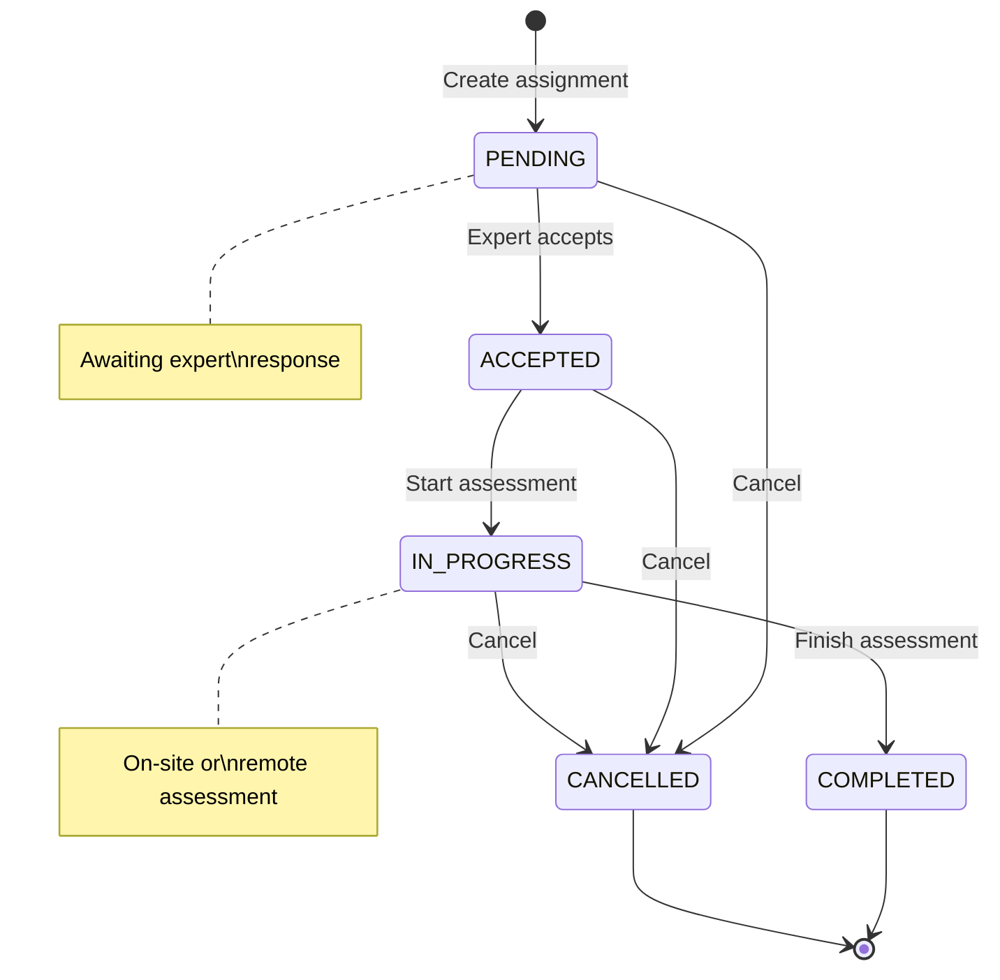
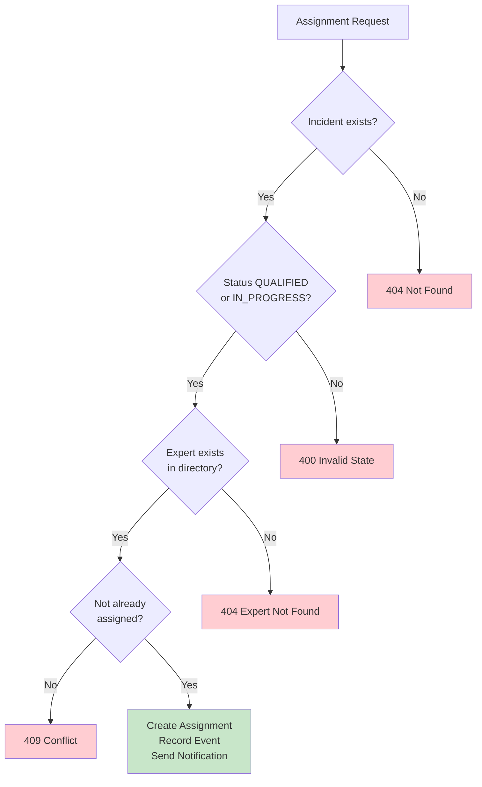

# Expert Assignment

## Overview

The Expert Assignment feature enables assigning qualified experts to insurance incidents for damage assessment and claim evaluation. It validates expert existence, tracks assignment details, and integrates with the incident lifecycle.

### Business Value

- **Validated Assignments**: Only registered experts can be assigned
- **Scheduling Support**: Track scheduled assessment dates
- **Assignment History**: Complete record of all expert assignments
- **Status Tracking**: Monitor assignment progress

---

## User Stories

### US-EXP-001: Assign Expert to Incident
**As an** insurance operator
**I want to** assign an expert to an incident
**So that** damage assessment can be performed

**Acceptance Criteria**:
- Expert must exist in experts directory
- Incident must be in QUALIFIED or IN_PROGRESS status
- Assignment creates record with timestamp
- EXPERT_ASSIGNED event recorded
- Notification sent to configured webhooks

### US-EXP-002: Schedule Expert Visit
**As an** insurance operator
**I want to** schedule an expert visit date
**So that** the policyholder knows when to expect assessment

**Acceptance Criteria**:
- Optional scheduledDate field
- Date must be in the future
- Notes can be added for special instructions

### US-EXP-003: View Expert Assignments
**As an** insurance operator
**I want to** see all experts assigned to an incident
**So that** I know who is handling the assessment

**Acceptance Criteria**:
- List all assignments for an incident
- Show expert details (name, contact)
- Show assignment status and dates

---

## Business Rules

| Rule ID | Description | Enforcement |
|---------|-------------|-------------|
| BR-EXP-001 | Expert must exist in directory | Validation via Directory Service |
| BR-EXP-002 | Incident must be QUALIFIED or IN_PROGRESS | State check before assignment |
| BR-EXP-003 | Same expert cannot be assigned twice | Unique constraint on (incident_id, expert_id) |
| BR-EXP-004 | Scheduled date must be in future | Validation on request |

---

## API Endpoint

### Assign Expert

**POST** `/api/v1/incidents/{incidentId}/expert`

**Request Body**:
```json
{
  "expertId": "e5f6g7h8-1234-5678-90ab-cdef01234567",
  "scheduledDate": "2026-01-25T10:00:00Z",
  "notes": "On-site assessment for water damage. Access code: 1234"
}
```

**Response (201 Created)**:
```json
{
  "id": "a1b2c3d4-5678-90ab-cdef-123456789012",
  "incidentId": "550e8400-e29b-41d4-a716-446655440000",
  "expertId": "e5f6g7h8-1234-5678-90ab-cdef01234567",
  "assignedAt": "2026-01-22T10:30:00Z",
  "assignedBy": "operator-uuid",
  "scheduledDate": "2026-01-25T10:00:00Z",
  "status": "PENDING",
  "notes": "On-site assessment for water damage. Access code: 1234"
}
```

**Error Responses**:

| Code | Condition |
|------|-----------|
| 400 | Invalid request (missing expertId) |
| 400 | Incident not in valid state |
| 404 | Incident not found |
| 404 | Expert not found in directory |
| 409 | Expert already assigned to incident |

---

## Assignment Status

| Status | Description |
|--------|-------------|
| PENDING | Assignment created, awaiting expert acceptance |
| ACCEPTED | Expert has accepted the assignment |
| IN_PROGRESS | Assessment underway |
| COMPLETED | Assessment finished |
| CANCELLED | Assignment cancelled |

### Status Transitions



```
PENDING ──► ACCEPTED ──► IN_PROGRESS ──► COMPLETED
   │            │              │
   │            │              ▼
   └────────────┴──────────► CANCELLED
```

---

## Data Model

### ExpertAssignment Entity

| Field | Type | Constraints | Description |
|-------|------|-------------|-------------|
| id | UUID | PK | Assignment identifier |
| incidentId | UUID | FK, NOT NULL | Reference to incident |
| expertId | UUID | NOT NULL | Reference to expert directory |
| assignedAt | Instant | NOT NULL | When assignment was created |
| assignedBy | UUID | | User who created assignment |
| scheduledDate | Instant | | Planned assessment date |
| completedDate | Instant | | Actual completion date |
| status | Enum | NOT NULL | Assignment status |
| notes | String | | Assignment instructions |

### Database Schema

```sql
CREATE TABLE expert_assignments (
    id UUID PRIMARY KEY,
    incident_id UUID NOT NULL REFERENCES incidents(id),
    expert_id UUID NOT NULL,
    assigned_at TIMESTAMP NOT NULL,
    assigned_by UUID,
    scheduled_date TIMESTAMP,
    completed_date TIMESTAMP,
    status VARCHAR(50) NOT NULL DEFAULT 'PENDING',
    notes TEXT,
    UNIQUE(incident_id, expert_id)
);

CREATE INDEX idx_expert_assignments_incident ON expert_assignments(incident_id);
CREATE INDEX idx_expert_assignments_expert ON expert_assignments(expert_id);
```

---

## Validation Flow



```
Assignment Request
        │
        ▼
┌───────────────────────┐
│ Check Incident Exists │──── 404 Not Found
└───────────┬───────────┘
            │
            ▼
┌───────────────────────┐
│ Check Incident Status │──── 400 Invalid State
│ (QUALIFIED or         │     "Cannot assign expert to
│  IN_PROGRESS)         │      DECLARED incident"
└───────────┬───────────┘
            │
            ▼
┌───────────────────────┐
│ Validate Expert       │──── 404 Expert Not Found
│ (call Experts Service)│
└───────────┬───────────┘
            │
            ▼
┌───────────────────────┐
│ Check Not Already     │──── 409 Conflict
│ Assigned              │     "Expert already assigned"
└───────────┬───────────┘
            │
            ▼
┌───────────────────────┐
│ Create Assignment     │
│ Record Event          │
│ Send Notification     │
└───────────────────────┘
```

---

## Side Effects

When an expert is assigned:

1. **Assignment Record Created**
   - Stored in expert_assignments table
   - Timestamp and user recorded

2. **Incident Event Logged**
   ```json
   {
     "eventType": "EXPERT_ASSIGNED",
     "incidentId": "...",
     "payload": {
       "expertId": "...",
       "scheduledDate": "2026-01-25T10:00:00Z"
     },
     "occurredAt": "2026-01-22T10:30:00Z"
   }
   ```

3. **Status Transition** (if QUALIFIED)
   - Incident status changes to IN_PROGRESS
   - STATUS_CHANGED event also recorded

4. **Notification Sent**
   - EXPERT_ASSIGNED notification created
   - Dispatched to configured webhooks

---

## Portal Integration

### Claim Detail View

The portal displays expert assignments with resolved names:

```json
{
  "expertAssignments": [
    {
      "id": "a1b2c3d4-5678-90ab-cdef-123456789012",
      "expert": {
        "id": "e5f6g7h8-1234-5678-90ab-cdef01234567",
        "name": "Jane Expert",
        "email": "jane@expertcorp.com",
        "phone": "+33612345678"
      },
      "scheduledDate": "2026-01-25T10:00:00Z",
      "status": "PENDING",
      "notes": "On-site assessment",
      "assignedAt": "2026-01-22T10:30:00Z"
    }
  ]
}
```

### Available Experts Endpoint

**GET** `/api/portal/v1/experts`

Returns list of all experts for assignment dropdown:

```json
[
  {
    "id": "e5f6g7h8-1234-5678-90ab-cdef01234567",
    "name": "Jane Expert",
    "type": "individual",
    "email": "jane@expertcorp.com",
    "phone": "+33612345678"
  }
]
```

---

## Testing

### Assign Expert

```bash
# First, create an incident and qualify it
INCIDENT_ID="550e8400-e29b-41d4-a716-446655440000"

# Qualify the incident
curl -X PUT "http://localhost:8085/api/v1/incidents/$INCIDENT_ID/status" \
  -H "Content-Type: application/json" \
  -d '{"status": "QUALIFIED"}'

# Assign expert
curl -X POST "http://localhost:8085/api/v1/incidents/$INCIDENT_ID/expert" \
  -H "Content-Type: application/json" \
  -d '{
    "expertId": "e5f6g7h8-1234-5678-90ab-cdef01234567",
    "scheduledDate": "2026-01-25T10:00:00Z",
    "notes": "Basement water damage assessment"
  }'
```

### Check Assignment Created

```bash
# Get incident detail (includes assignments)
curl "http://localhost:8085/api/v1/incidents/$INCIDENT_ID"

# Check incident history
curl "http://localhost:8085/api/v1/incidents/$INCIDENT_ID/history"
```

### Test Invalid Assignment

```bash
# Try to assign to DECLARED incident (should fail)
curl -X POST "http://localhost:8085/api/v1/incidents/$INCIDENT_ID/expert" \
  -H "Content-Type: application/json" \
  -d '{"expertId": "e5f6g7h8-1234-5678-90ab-cdef01234567"}'
# Returns 400: "Cannot assign expert to DECLARED incident"

# Try to assign non-existent expert
curl -X POST "http://localhost:8085/api/v1/incidents/$INCIDENT_ID/expert" \
  -H "Content-Type: application/json" \
  -d '{"expertId": "00000000-0000-0000-0000-000000000000"}'
# Returns 404: "Expert not found"
```

---

## Related Documentation

- [PRD.md](../PRD.md) - Product requirements (FR-INC-003)
- [incident-lifecycle.md](incident-lifecycle.md) - Incident state machine
- [webhook-notifications.md](webhook-notifications.md) - Assignment notifications
- [directory-management.md](directory-management.md) - Experts directory
