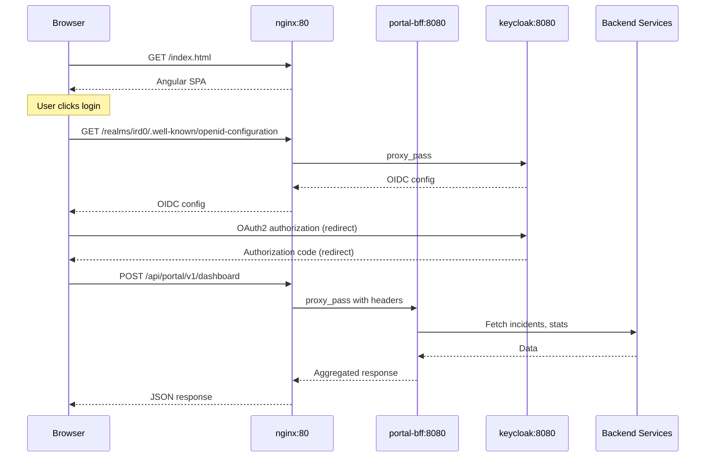
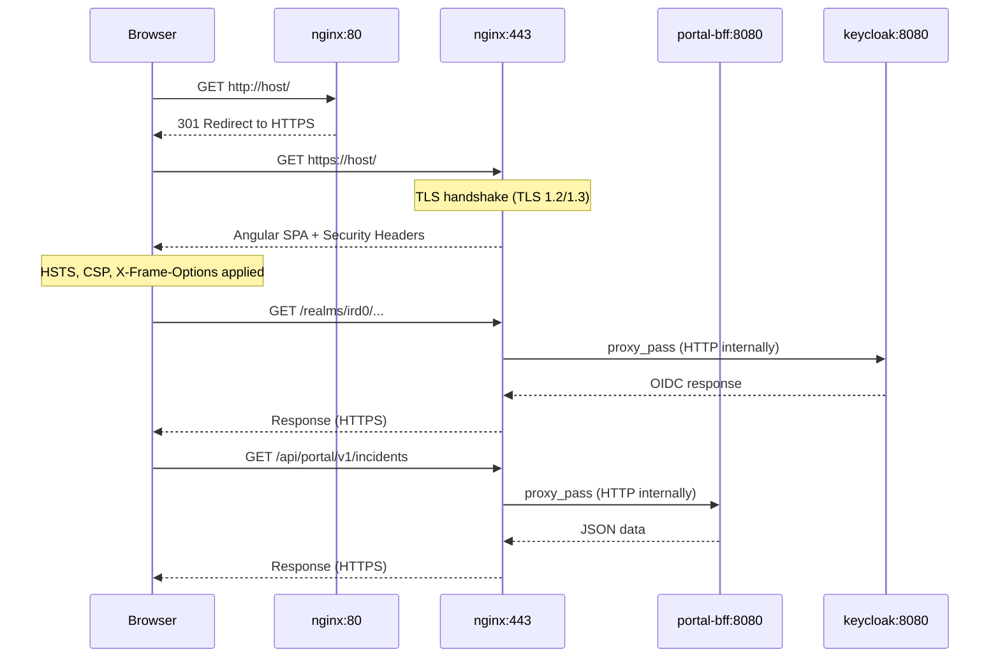
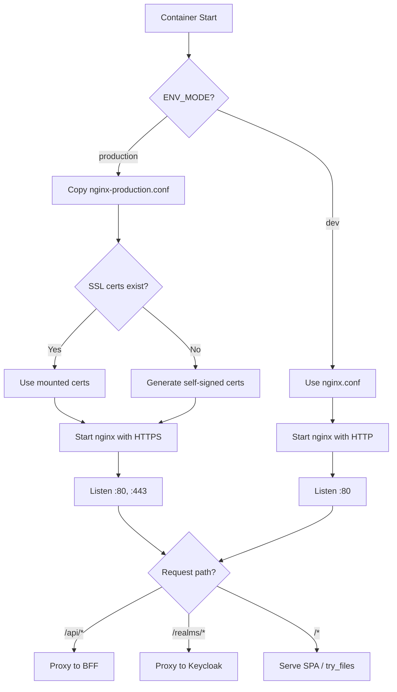

# Portal Frontend Deployment

## Overview

The Portal Frontend is an Angular SPA deployed as a containerized nginx service. It serves static assets and proxies API requests to the Portal BFF and Keycloak identity provider.

## Architecture

```
                    ┌─────────────────────────────────────────┐
                    │          portal-frontend                 │
                    │          (nginx:alpine)                  │
                    │                                          │
    Browser ───────►│  :80                                     │
                    │   ├── /api/*  ──────────► portal-bff:8080│
                    │   ├── /realms/* ────────► keycloak:8080  │
                    │   └── /* (SPA) ─────────► /index.html    │
                    └─────────────────────────────────────────┘
```

## Request Flow

The portal frontend operates differently depending on `ENV_MODE`:

### Development Mode (`ENV_MODE=dev`)

HTTP-only mode on port 80. Suitable for local development.



### Production Mode (`ENV_MODE=production`)

HTTPS mode with HTTP-to-HTTPS redirect. SSL certificates are auto-generated (self-signed) or mounted from `/etc/nginx/ssl`.



### Container Startup Flow



## Build Process

The container uses a multi-stage Docker build:

1. **Build Stage** (Node.js 22 Alpine)
   - Install dependencies with pnpm
   - Build Angular app with production configuration
   - Output: optimized bundles with content hashing

2. **Serve Stage** (nginx:alpine)
   - Copy built assets from build stage
   - Configure nginx with custom configuration
   - Expose port 80

## Proxy Configuration

Nginx reverse proxy handles:

| Path | Target | Purpose |
|------|--------|---------|
| `/api/*` | `http://bff:8080` | API requests to Portal BFF |
| `/realms/*` | `http://keycloak:8080` | OIDC endpoints for authentication |
| `/*` | `/index.html` | SPA fallback routing |

## Caching Strategy

| Asset Type | Cache Control |
|------------|---------------|
| Hashed JS/CSS (`*.hash.js`, `*.hash.css`) | 1 year, immutable |
| `index.html` | no-cache |
| `silent-refresh.html` | no-cache |
| Other assets | Default browser caching |

## Environment Configuration

The Angular app uses relative paths and expects:

- **Production** (`ENV_MODE=production`): HTTPS with nginx, HTTP redirects to HTTPS
- **Development** (`ENV_MODE=dev`): HTTP-only with nginx

| Variable | Default | Description |
|----------|---------|-------------|
| `ENV_MODE` | `dev` | Deployment mode: `dev` (HTTP) or `production` (HTTPS) |
| `PORTAL_FRONTEND_HOST_PORT` | `4200` | Host port for HTTP access |
| `PORTAL_FRONTEND_HTTPS_PORT` | `4443` | Host port for HTTPS access (production only) |
| `PORTAL_FRONTEND_SERVICE_HOST` | `portal` | Docker network alias |

## Docker Compose Integration

```yaml
portal-frontend:
  build:
    context: ..
    dockerfile: portal-frontend/Dockerfile
  ports:
    - "${PORTAL_FRONTEND_HOST_PORT}:80"
  depends_on:
    - portal-bff
    - keycloak
```

## Health Check

Nginx serves a static health endpoint via the root path. Docker health check verifies the server responds to HTTP requests.

## Security Considerations

- Gzip compression enabled for text-based assets
- Static files served read-only
- No sensitive data in container (build-time configuration only)
- **Production mode** (`ENV_MODE=production`):
  - HTTPS with TLS 1.2/1.3
  - HTTP Strict Transport Security (HSTS)
  - Content Security Policy (CSP)
  - X-Frame-Options, X-Content-Type-Options, Referrer-Policy headers
  - Self-signed certs auto-generated if none mounted
  - Mount real certs to `/etc/nginx/ssl/` for production use

## Related Documentation

- [user-authentication.refined.md](user-authentication.refined.md) - Authentication flow
- [ARCHITECTURE.md](../ARCHITECTURE.md) - System architecture
- [docker.md](../topics/docker.md) - Docker configuration
