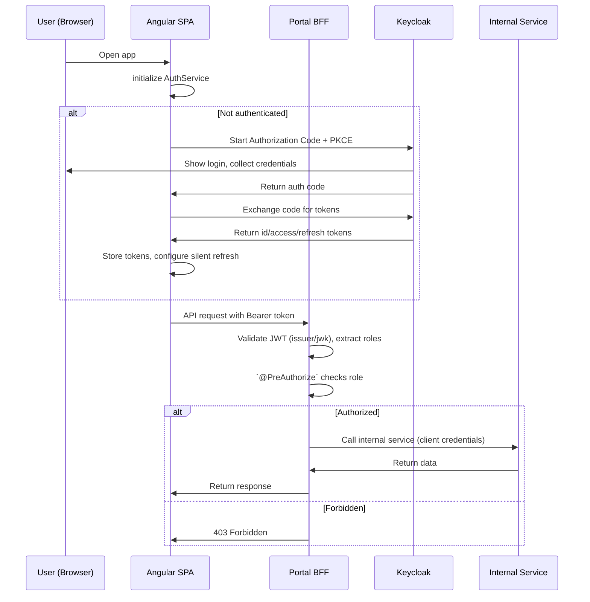

# User Authentication and Authorization

## Overview

The User Authentication and Authorization feature secures the insurance portal using Keycloak as the Identity Provider (IdP) with OpenID Connect. The Angular SPA authenticates users via Keycloak, the Portal BFF enforces authorization on all endpoints, and internal microservices are accessed only by the BFF using service-level credentials.




### Business Value

- **Access Control**: Only authorized users can view and manage claims
- **Role-Based Workflows**: Viewers see read-only data, managers perform actions, admins access all operations
- **Security Boundary at BFF**: Authorization enforced server-side, not in the browser
- **Service Isolation**: Internal microservices never receive user tokens

---

## User Stories

### US-AUTH-001: Authenticate via Keycloak Login Page
**As an** unauthenticated user
**I want to** be redirected to Keycloak to log in
**So that** I can access the insurance portal

**Acceptance Criteria**:
- Opening the portal redirects to Keycloak login page
- Authentication uses Authorization Code Flow with PKCE
- Successful login returns user to the originally requested page
- No credentials are handled by the Angular SPA

### US-AUTH-002: Access Protected Routes After Authentication
**As an** authenticated user
**I want to** access dashboard and claims pages
**So that** I can perform my work

**Acceptance Criteria**:
- `/dashboard` and `/claims/**` routes require authentication
- Unauthenticated access redirects to Keycloak login
- After login, user returns to the requested route
- Auth guard protects all application routes

### US-AUTH-003: View User Identity in Navigation
**As an** authenticated user
**I want to** see my name and email in the sidenav
**So that** I know which account is active

**Acceptance Criteria**:
- Sidenav header displays user's full name and email
- User avatar shows initials placeholder
- Information sourced from the ID token claims

### US-AUTH-004: Logout from Application
**As an** authenticated user
**I want to** log out from the portal
**So that** my session is terminated

**Acceptance Criteria**:
- Logout button visible in sidenav footer
- Click triggers Keycloak logout (end session endpoint)
- In-memory tokens are cleared
- User is redirected to Keycloak login page

### US-AUTH-005: Automatic Token Refresh
**As an** authenticated user
**I want to** stay logged in without re-entering credentials
**So that** my workflow is not interrupted

**Acceptance Criteria**:
- Access tokens have short lifetime (5 minutes, configured in Keycloak)
- Silent refresh renews tokens before expiry
- On refresh failure, user is redirected to Keycloak login
- No user interaction required for renewal

### US-AUTH-006: Role-Based UI Element Visibility
**As a** user with a specific role
**I want to** see only the UI elements relevant to my role
**So that** the interface is not cluttered with inaccessible actions

**Acceptance Criteria**:
- `claims-viewer`: sees claims list, detail, dashboard (read-only)
- `claims-manager`: additionally sees create claim, update status, assign expert, add comment buttons
- `claims-admin`: sees all elements including future administrative operations
- UI role checks are cosmetic only; server enforces authorization

### US-AUTH-007: BFF Enforces Authorization on Endpoints
**As a** system administrator
**I want** the BFF to enforce role-based access on all endpoints
**So that** unauthorized API calls are rejected regardless of the frontend

**Acceptance Criteria**:
- Each endpoint requires a minimum role (see authorization matrix)
- Role hierarchy: `claims-admin` > `claims-manager` > `claims-viewer`
- Missing or invalid token returns 401
- Insufficient role returns 403
- Authorization uses client roles from the JWT

### US-AUTH-008: BFF Calls Microservices with Service Credentials
**As a** system architect
**I want** the BFF to use client credentials for internal calls
**So that** user tokens are never exposed to internal services

**Acceptance Criteria**:
- BFF obtains service token via OAuth2 client credentials flow
- Service tokens are cached and auto-refreshed
- User access tokens are never forwarded to microservices
- Internal microservices validate the caller is the BFF client

### US-AUTH-009: Admin Accesses Administrative Operations
**As an** administrator
**I want to** access administrative operations
**So that** I can manage the platform

**Acceptance Criteria**:
- `claims-admin` role grants access to all existing endpoints
- Future administrative endpoints will require `claims-admin`
- Admin inherits all `claims-manager` and `claims-viewer` permissions

---

## Architecture

### Authentication Flow

```
┌───────────┐       ┌──────────┐       ┌──────────┐       ┌─────────────┐
│  Angular  │       │ Keycloak │       │   BFF    │       │ Microservice│
│    SPA    │       │   IdP    │       │  :8090   │       │  :808x      │
└─────┬─────┘       └────┬─────┘       └────┬─────┘       └──────┬──────┘
      │  1. Open /dashboard                  │                     │
      │──────────────────────────────────────►                     │
      │                                      │                     │
      │  2. No token → redirect to Keycloak  │                     │
      │─────────────►│                       │                     │
      │              │                       │                     │
      │  3. User authenticates (login form)  │                     │
      │◄─────────────│                       │                     │
      │              │                       │                     │
      │  4. Authorization code + PKCE        │                     │
      │─────────────►│                       │                     │
      │              │                       │                     │
      │  5. Access token + ID token          │                     │
      │◄─────────────│                       │                     │
      │                                      │                     │
      │  6. GET /api/portal/v1/dashboard     │                     │
      │    Authorization: Bearer <token>     │                     │
      │──────────────────────────────────────►                     │
      │                                      │                     │
      │                    7. Validate JWT    │                     │
      │                    8. Extract roles   │                     │
      │                    9. Authorize       │                     │
      │                                      │                     │
      │                    10. Client credentials token             │
      │                                      │────────────────────►│
      │                                      │                     │
      │                    11. Response data  │                     │
      │                                      │◄────────────────────│
      │                                      │                     │
      │  12. Dashboard data                  │                     │
      │◄──────────────────────────────────────                     │
```

### Token Refresh Flow

```
┌───────────┐       ┌──────────┐
│  Angular  │       │ Keycloak │
│    SPA    │       │   IdP    │
└─────┬─────┘       └────┬─────┘
      │                   │
      │  Token nearing    │
      │  expiry (auto)    │
      │                   │
      │  Refresh token    │
      │  request          │
      │──────────────────►│
      │                   │
      │  New access token │
      │  + refresh token  │
      │◄──────────────────│
      │                   │
      │  Store in memory  │
      │                   │
```

### Logout Flow

```
┌───────────┐       ┌──────────┐
│  Angular  │       │ Keycloak │
│    SPA    │       │   IdP    │
└─────┬─────┘       └────┬─────┘
      │                   │
      │  1. User clicks   │
      │     logout        │
      │                   │
      │  2. Clear in-     │
      │     memory tokens │
      │                   │
      │  3. Redirect to   │
      │     end_session   │
      │──────────────────►│
      │                   │
      │  4. Session       │
      │     destroyed     │
      │                   │
      │  5. Redirect to   │
      │     login page    │
      │◄──────────────────│
```

### Service-to-Service Flow

```
┌──────────┐       ┌──────────┐       ┌─────────────┐
│   BFF    │       │ Keycloak │       │ Microservice│
│  :8090   │       │   IdP    │       │  :808x      │
└────┬─────┘       └────┬─────┘       └──────┬──────┘
     │                   │                     │
     │  1. Client        │                     │
     │     credentials   │                     │
     │     grant         │                     │
     │──────────────────►│                     │
     │                   │                     │
     │  2. Service       │                     │
     │     access token  │                     │
     │◄──────────────────│                     │
     │                   │                     │
     │  3. GET /api/v1/incidents              │
     │     Authorization: Bearer <svc-token>  │
     │────────────────────────────────────────►│
     │                                         │
     │  4. Validate token, verify BFF client   │
     │                                         │
     │  5. Response data                       │
     │◄────────────────────────────────────────│
```

---

## Keycloak Configuration Specification

### Realm

| Setting | Value |
|---------|-------|
| Realm name | `ird0` |
| Display name | IRD0 Insurance Platform |
| Login theme | Keycloak default |
| Token lifespan (access) | 5 minutes |
| Token lifespan (refresh) | 30 minutes |
| SSO session idle | 30 minutes |

### Clients

#### `ird0-portal` (Angular SPA)

| Setting | Value |
|---------|-------|
| Client ID | `ird0-portal` |
| Client type | Public |
| Authentication flow | Authorization Code with PKCE |
| Valid redirect URIs | `http://localhost:4200/*` |
| Valid post-logout URIs | `http://localhost:4200/*` |
| Web origins | `http://localhost:4200` |
| Implicit flow | Disabled |
| Direct access grants | Disabled |

#### `ird0-portal-bff` (BFF Resource Server + Service Client)

| Setting | Value |
|---------|-------|
| Client ID | `ird0-portal-bff` |
| Client type | Confidential |
| Authentication flow | Client credentials |
| Service accounts enabled | Yes |
| Standard flow | Disabled |
| Client roles | `claims-viewer`, `claims-manager`, `claims-admin` |

### Client Roles (on `ird0-portal-bff`)

| Role | Description | Inherits |
|------|-------------|----------|
| `claims-viewer` | Read-only access to claims, dashboard, actors | — |
| `claims-manager` | Create claims, update status, assign experts, add comments | `claims-viewer` |
| `claims-admin` | Full access including future administrative operations | `claims-manager` |

### Role Hierarchy

```
claims-admin
  └── claims-manager
        └── claims-viewer
```

Composite roles configured in Keycloak: `claims-admin` includes `claims-manager`, which includes `claims-viewer`.

### Test Users

| Username | Password | Client Roles (on `ird0-portal-bff`) |
|----------|----------|--------------------------------------|
| `viewer` | `viewer` | `claims-viewer` |
| `manager` | `manager` | `claims-manager` |
| `admin` | `admin` | `claims-admin` |

### Disabled Flows

- **Implicit flow**: Deprecated, insecure for SPAs
- **Direct access grants**: Resource owner password credentials not needed

---

## Angular SPA Specification

### Auth Library

**Library**: `angular-oauth2-oidc`

Framework-agnostic OIDC library for Angular. Supports Authorization Code Flow with PKCE, token refresh, and discovery document auto-configuration.

### Auth Service

```typescript
@Injectable({ providedIn: 'root' })
export class AuthService {
  // Reactive state (signals)
  readonly isAuthenticated: Signal<boolean>;
  readonly userProfile: Signal<UserProfile | null>;

  // Configuration
  // - Discovery document: {keycloakUrl}/realms/ird0/.well-known/openid-configuration
  // - Client ID: ird0-portal
  // - Scope: openid profile email
  // - Response type: code (Authorization Code Flow)
  // - PKCE: enabled (code_challenge_method: S256)
  // - Token storage: in-memory only (no localStorage/sessionStorage)
  // - Silent refresh: via check-sso iframe on app init
  // - Post-login redirect: saved URL or /dashboard
  // - Post-logout redirect: Keycloak login page

  // Methods
  login(): void;              // Redirect to Keycloak
  logout(): void;             // Clear tokens + Keycloak end_session
  hasRole(role: string): boolean;  // Check client role in token
  getAccessToken(): string | null; // For interceptor
}

interface UserProfile {
  name: string;
  email: string;
  roles: string[];   // Client roles from resource_access.ird0-portal-bff.roles
}
```

**Token Storage**: In-memory only. No `localStorage` or `sessionStorage` for XSS mitigation. Session restore on page reload handled by `check-sso` silent check against Keycloak.

### Auth Interceptor

```typescript
export const authInterceptor: HttpInterceptorFn = (req, next) => {
  // Attach Authorization: Bearer <token> to all /api/ requests
  // Skip public endpoints (if any)
  // On 401 response: trigger re-authentication via Keycloak redirect
};
```

Registered in `app.config.ts` alongside existing interceptors:

```typescript
provideHttpClient(
  withInterceptors([authInterceptor, errorInterceptor, loadingInterceptor])
)
```

### Auth Guard

```typescript
export const authGuard: CanActivateFn = (route, state) => {
  // Check isAuthenticated
  // If not authenticated: save target URL, redirect to Keycloak login
  // If authenticated: return true
  // Returns: UrlTree | true
};
```

### Route Changes

```typescript
export const routes: Routes = [
  { path: '', redirectTo: 'dashboard', pathMatch: 'full' },
  {
    path: 'dashboard',
    canActivate: [authGuard],
    loadComponent: () => import('./features/dashboard/...').then(m => m.DashboardPageComponent)
  },
  {
    path: 'claims',
    canActivate: [authGuard],
    children: [
      { path: '', loadComponent: () => import('./features/claims/...').then(m => m.ClaimsListPageComponent) },
      { path: 'new', loadComponent: () => import('./features/claims/...').then(m => m.ClaimCreatePageComponent) },
      { path: ':id', loadComponent: () => import('./features/claims/...').then(m => m.ClaimDetailPageComponent) }
    ]
  },
  { path: 'unauthorized', loadComponent: () => import('./...').then(m => m.UnauthorizedPageComponent) },
  { path: '**', redirectTo: 'dashboard' }
];
```

Key changes:
- `canActivate: [authGuard]` added to `dashboard` and `claims` routes
- No dedicated `/login` route — Keycloak handles login UI externally
- Optional `/unauthorized` route for insufficient role feedback

### App Component Changes

```
┌─────────────────────────────────────────────────────────┐
│  mat-sidenav                                             │
│  ┌─────────────────────────────────────────────────────┐ │
│  │  🏢  Insurance Portal                               │ │
│  ├─────────────────────────────────────────────────────┤ │
│  │  📊  Dashboard                                       │ │
│  │  📋  Claims                                          │ │
│  ├─────────────────────────────────────────────────────┤ │
│  │  ┌──┐                                               │ │
│  │  │JD│  John Doe              ▼                      │ │
│  │  └──┘  john.doe@example.com                         │ │
│  │        └── Logout menu                              │ │
│  └─────────────────────────────────────────────────────┘ │
│                                                          │
│  mat-sidenav-content                                     │
│  ┌─────────────────────────────────────────────────────┐ │
│  │  <router-outlet>                                     │ │
│  └─────────────────────────────────────────────────────┘ │
└─────────────────────────────────────────────────────────┘
```

Changes to `AppComponent`:
- Sidenav footer shows authenticated user name and email with dropdown menu (from `AuthService.userProfile`)
- Avatar placeholder with user initials (computed from given_name/family_name or username)
- Logout option in user dropdown menu calls `AuthService.logout()`
- Sidenav and content only rendered when authenticated

### Error Interceptor Update

Existing `errorInterceptor` enhanced for auth-specific status codes:

| Status | Current Behavior | New Behavior |
|--------|-----------------|--------------|
| 401 | Log "Unauthorized" message | Trigger `AuthService.logout()` + Keycloak redirect |
| 403 | Log "Access denied" message | Show "Access denied" snackbar (keep behavior) |

### Token Lifecycle

```
┌────────────────────────────────────────────────────────────────┐
│  Time                                                          │
│  ├── 0:00  Login → access token (5 min) + refresh token       │
│  ├── 4:00  Silent refresh triggered (before expiry)            │
│  │         → new access token (5 min) + new refresh token     │
│  ├── 8:00  Silent refresh triggered again                      │
│  │         → new access token + refresh token                 │
│  ├── ...   Continues while user is active                      │
│  ├── 30:00 If idle → refresh token expires                     │
│  │         → refresh fails → redirect to Keycloak login       │
│  └─────────────────────────────────────────────────────────────┘
```

- Access token: 5 minutes (configured in Keycloak)
- Refresh token: 30 minutes (Keycloak SSO session idle timeout)
- `OAuthService.setupAutomaticSilentRefresh()` handles renewal
- On refresh failure: redirect to Keycloak login

---

## Portal BFF Security Specification

### Dependencies

Add to `microservices/portal-bff/pom.xml`:

```xml
<dependency>
    <groupId>org.springframework.boot</groupId>
    <artifactId>spring-boot-starter-oauth2-resource-server</artifactId>
</dependency>
<dependency>
    <groupId>org.springframework.boot</groupId>
    <artifactId>spring-boot-starter-oauth2-client</artifactId>
</dependency>
```

### SecurityFilterChain

```java
@Configuration
@EnableWebSecurity
public class SecurityConfig {

    @Bean
    public SecurityFilterChain securityFilterChain(HttpSecurity http) {
        http
            .cors(Customizer.withDefaults())
            .csrf(csrf -> csrf.disable())                    // Stateless API
            .sessionManagement(sm ->
                sm.sessionCreationPolicy(SessionCreationPolicy.STATELESS))
            .authorizeHttpRequests(auth -> auth
                .requestMatchers("/actuator/health").permitAll()
                .requestMatchers("/v3/api-docs/**").permitAll()
                .requestMatchers("/swagger-ui/**").permitAll()
                // See endpoint authorization matrix below
                .anyRequest().authenticated()
            )
            .oauth2ResourceServer(oauth2 ->
                oauth2.jwt(jwt ->
                    jwt.jwtAuthenticationConverter(jwtAuthenticationConverter())
                )
            );
        return http.build();
    }
}
```

### JWT Role Mapping

Extract client roles from `resource_access.ird0-portal-bff.roles` in the JWT payload:

```json
{
  "resource_access": {
    "ird0-portal-bff": {
      "roles": ["claims-viewer", "claims-manager"]
    }
  }
}
```

Custom `JwtAuthenticationConverter` maps these to Spring Security `ROLE_` prefixed authorities:
- `claims-viewer` → `ROLE_claims-viewer`
- `claims-manager` → `ROLE_claims-manager`
- `claims-admin` → `ROLE_claims-admin`

### Endpoint Authorization Matrix

| Endpoint | Method | Minimum Role |
|----------|--------|--------------|
| `/api/portal/v1/dashboard` | GET | `claims-viewer` |
| `/api/portal/v1/claims` | GET | `claims-viewer` |
| `/api/portal/v1/claims` | POST | `claims-manager` |
| `/api/portal/v1/claims/{id}` | GET | `claims-viewer` |
| `/api/portal/v1/claims/{id}/status` | PUT | `claims-manager` |
| `/api/portal/v1/claims/{id}/expert` | POST | `claims-manager` |
| `/api/portal/v1/claims/{id}/comments` | GET | `claims-viewer` |
| `/api/portal/v1/claims/{id}/comments` | POST | `claims-manager` |
| `/api/portal/v1/claims/{id}/history` | GET | `claims-viewer` |
| `/api/portal/v1/policyholders` | GET | `claims-viewer` |
| `/api/portal/v1/experts` | GET | `claims-viewer` |
| `/api/portal/v1/insurers` | GET | `claims-viewer` |

Role hierarchy enforced: a user with `claims-manager` automatically has `claims-viewer` access. A user with `claims-admin` has all access.

### Application Properties

```yaml
# Resource server (JWT validation)
spring:
  security:
    oauth2:
      resourceserver:
        jwt:
          issuer-uri: ${KEYCLOAK_ISSUER_URI:http://localhost:8180/realms/ird0}

      # Client credentials (service-to-service)
      client:
        registration:
          portal-bff:
            client-id: ird0-portal-bff
            client-secret: ${KEYCLOAK_CLIENT_SECRET}
            authorization-grant-type: client_credentials
            scope: openid
        provider:
          keycloak:
            issuer-uri: ${KEYCLOAK_ISSUER_URI:http://localhost:8180/realms/ird0}
```

### Development Profile (`nosecurity`)

A `nosecurity` Spring profile bypasses authentication for local development without Keycloak:

```java
@Profile("nosecurity")
@Configuration
public class NoSecurityConfig {
    @Bean
    public SecurityFilterChain noSecurityFilterChain(HttpSecurity http) {
        http
            .cors(Customizer.withDefaults())
            .csrf(csrf -> csrf.disable())
            .authorizeHttpRequests(auth -> auth.anyRequest().permitAll());
        return http.build();
    }
}
```

Activate with `--spring.profiles.active=nosecurity` or `SPRING_PROFILES_ACTIVE=nosecurity`.

### Service-to-Service Authentication

```
┌──────────────────────────────────────────────────────────────────┐
│  Portal BFF                                                       │
│                                                                   │
│  ┌────────────────────────────────────┐                          │
│  │  OAuth2AuthorizedClientManager     │                          │
│  │  - Obtains token via client creds  │                          │
│  │  - Caches token until near expiry  │                          │
│  │  - Auto-refreshes on demand        │                          │
│  └──────────────────┬─────────────────┘                          │
│                      │                                            │
│  ┌──────────────────▼─────────────────┐                          │
│  │  RestClient (per microservice)     │                          │
│  │  Authorization: Bearer <svc-token> │                          │
│  └──────────────────┬─────────────────┘                          │
└──────────────────────┼────────────────────────────────────────────┘
                       │
          ┌────────────┼────────────┐
          ▼            ▼            ▼
   ┌───────────┐ ┌──────────┐ ┌──────────┐
   │ Incident  │ │ Directory│ │ Directory│
   │  :8085    │ │  :8081   │ │  :8082   │
   └───────────┘ └──────────┘ └──────────┘
```

- BFF obtains service token via OAuth2 client credentials flow
- `OAuth2AuthorizedClientManager` manages token lifecycle
- Service tokens cached and auto-refreshed
- Internal microservices validate caller is the `ird0-portal-bff` client

---

## Docker Compose Addition

### Keycloak Service

Add to `deploy/docker-compose.infrastructure.yml`:

```yaml
keycloak:
  image: quay.io/keycloak/keycloak:26.0
  container_name: keycloak
  restart: unless-stopped
  command: start-dev --import-realm
  ports:
    - "8180:8080"
  deploy:
    resources:
      limits:
        cpus: '1'
        memory: 512M
      reservations:
        memory: 256M
  environment:
    KC_DB: postgres
    KC_DB_URL: jdbc:postgresql://postgres:5432/keycloak_db
    KC_DB_USERNAME: ${POSTGRES_USER}
    KC_DB_PASSWORD: ${POSTGRES_PASSWORD}
    KC_BOOTSTRAP_ADMIN_USERNAME: ${KEYCLOAK_ADMIN_USER:-admin}
    KC_BOOTSTRAP_ADMIN_PASSWORD: ${KEYCLOAK_ADMIN_PASSWORD:-admin}
  volumes:
    - ../keycloak/realm-export.json:/opt/keycloak/data/import/realm-export.json:ro
  depends_on:
    postgres:
      condition: service_healthy
  healthcheck:
    test: ["CMD-SHELL", "exec 3<>/dev/tcp/localhost/8080 && echo -e 'GET /health/ready HTTP/1.1\r\nHost: localhost\r\n\r\n' >&3 && cat <&3 | grep -q '200'"]
    interval: 15s
    timeout: 5s
    retries: 10
    start_period: 30s
  networks:
    - insurance-network
```

### Database Update

Add `keycloak_db` to the PostgreSQL `POSTGRES_MULTIPLE_DATABASES` environment variable:

```yaml
POSTGRES_MULTIPLE_DATABASES: policyholders_db,experts_db,providers_db,insurers_db,incidents_db,notifications_db,keycloak_db
```

### Realm Import

Place realm configuration JSON at `keycloak/realm-export.json`. This file defines:
- Realm `ird0` with all settings
- Client `ird0-portal` (public, PKCE)
- Client `ird0-portal-bff` (confidential, with client roles)
- Role hierarchy (composite roles)
- Test users with role assignments

Keycloak imports the realm on first start via `--import-realm`.

---

## Constraints

- Client roles on `ird0-portal-bff` are the primary authorization mechanism (no realm roles for domain concerns)
- User tokens are never forwarded to internal microservices
- Authorization is enforced only at the BFF level (the SPA is not a security boundary)
- Service-to-service communication is authenticated via client credentials
- Tokens are stored in memory only (not `localStorage` or `sessionStorage`)
- `nosecurity` Spring profile is available for development without Keycloak
- The solution follows Keycloak and OAuth2/OIDC best practices

---

## Related Documentation

- [PRD.md](../PRD.md) — Product requirements
- [ARCHITECTURE.md](../ARCHITECTURE.md) — System architecture and BFF pattern
- [claims-management-ui.md](claims-management-ui.md) — Claims UI pages (protected by auth)
- [portal-dashboard.md](portal-dashboard.md) — Dashboard page (protected by auth)
