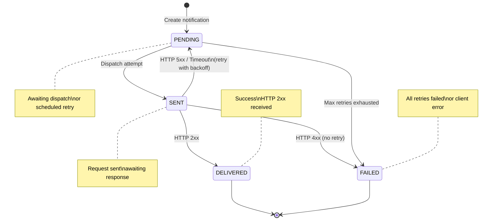
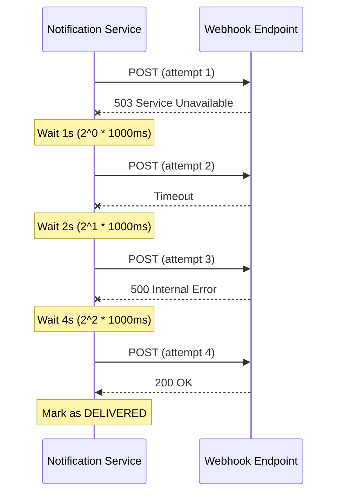

# Webhook Notifications

## Overview

The Webhook Notifications feature provides reliable event dispatch to external systems via HTTP webhooks. It includes immediate delivery attempts, exponential backoff retry logic, and comprehensive audit trails for all notification activity.

### Business Value

- **Real-time Integration**: External systems receive immediate event notifications
- **Reliable Delivery**: Exponential backoff ensures delivery despite transient failures
- **Complete Audit Trail**: All notification attempts logged with responses
- **Manual Recovery**: Failed notifications can be manually retried

---

## User Stories

### US-NOT-001: Receive Incident Notifications
**As an** external system
**I want to** receive webhook notifications for incident events
**So that** I can keep my system synchronized

**Acceptance Criteria**:
- Receive HTTP POST when incidents are created/updated
- Payload includes event type and incident details
- Headers include notification ID and event type

### US-NOT-002: Automatic Retry on Failure
**As a** system administrator
**I want** failed notifications to be automatically retried
**So that** transient failures don't cause data loss

**Acceptance Criteria**:
- Retry on HTTP 5xx, timeout, connection error
- No retry on HTTP 4xx (client error)
- Exponential backoff between retries
- Maximum 3 retry attempts

### US-NOT-003: Manual Retry
**As a** system administrator
**I want to** manually retry failed notifications
**So that** I can recover from persistent failures

**Acceptance Criteria**:
- POST endpoint to trigger retry
- Resets retry counter
- Follows normal retry logic

### US-NOT-004: View Notification Status
**As a** system administrator
**I want to** see the status of notifications
**So that** I can monitor integration health

**Acceptance Criteria**:
- List notifications by status
- View response codes and bodies
- See retry count and failure reasons

---

## Business Rules

| Rule ID | Description | Enforcement |
|---------|-------------|-------------|
| BR-NOT-001 | HTTP 4xx errors are not retried | Response code check |
| BR-NOT-002 | Maximum 3 retry attempts | Configuration |
| BR-NOT-003 | Exponential backoff: 1s, 2s, 4s | Retry scheduler |
| BR-NOT-004 | Response body truncated to 2000 chars | Storage logic |
| BR-NOT-005 | Webhook timeout: 15s total | HTTP client config |

---

## API Endpoints

### Base Path: `/api/v1/notifications`

| Method | Path | Description |
|--------|------|-------------|
| POST | `/webhook` | Create and dispatch notification |
| GET | `/{id}` | Get notification by ID |
| GET | `/` | List notifications (filtered) |
| GET | `/status/{status}` | List by status |
| POST | `/{id}/retry` | Retry failed notification |
| DELETE | `/{id}` | Cancel pending notification |

### Create Notification

**POST** `/api/v1/notifications/webhook`

```json
{
  "webhookUrl": "https://hooks.example.com/incidents",
  "eventType": "INCIDENT_DECLARED",
  "eventId": "550e8400-e29b-41d4-a716-446655440000",
  "incidentId": "550e8400-e29b-41d4-a716-446655440001",
  "payload": {
    "referenceNumber": "INC-2026-000001",
    "status": "DECLARED",
    "type": "WATER_DAMAGE",
    "policyholderId": "c9088e6f-86a4-4001-9a6a-554510787dd9"
  }
}
```

**Response (201 Created)**:
```json
{
  "id": "n1o2t3i4-5678-90ab-cdef-123456789012",
  "webhookUrl": "https://hooks.example.com/incidents",
  "eventType": "INCIDENT_DECLARED",
  "eventId": "550e8400-e29b-41d4-a716-446655440000",
  "status": "DELIVERED",
  "responseCode": 200,
  "retryCount": 0,
  "createdAt": "2026-01-22T10:30:00Z",
  "sentAt": "2026-01-22T10:30:01Z"
}
```

### List by Status

**GET** `/api/v1/notifications/status/FAILED`

```json
[
  {
    "id": "n1o2t3i4-5678-90ab-cdef-123456789012",
    "webhookUrl": "https://hooks.example.com/incidents",
    "status": "FAILED",
    "retryCount": 3,
    "failureReason": "Connection refused",
    "lastAttemptAt": "2026-01-22T10:31:07Z"
  }
]
```

### Manual Retry

**POST** `/api/v1/notifications/{id}/retry`

```json
{
  "id": "n1o2t3i4-5678-90ab-cdef-123456789012",
  "status": "PENDING",
  "retryCount": 0,
  "message": "Notification queued for retry"
}
```

---

## Notification Lifecycle

### Status Flow



### Retry Sequence



```
┌─────────┐   Immediate     ┌──────┐   HTTP 2xx   ┌──────────┐
│ PENDING ├───────────────►│ SENT ├─────────────►│DELIVERED │
└────┬────┘   dispatch      └──────┘              └──────────┘
     │
     │ HTTP 5xx / Timeout
     │
     ▼
┌─────────┐   Retry 1       ┌──────┐   HTTP 2xx
│ PENDING ├───(1s delay)───►│ SENT ├─────────────► DELIVERED
└────┬────┘                 └──────┘
     │
     │ Failure
     ▼
┌─────────┐   Retry 2       ┌──────┐
│ PENDING ├───(2s delay)───►│ SENT ├─────────────► DELIVERED
└────┬────┘                 └──────┘
     │
     │ Failure
     ▼
┌─────────┐   Retry 3       ┌──────┐
│ PENDING ├───(4s delay)───►│ SENT ├─────────────► DELIVERED
└────┬────┘                 └──────┘
     │
     │ All retries exhausted
     ▼
┌────────┐
│ FAILED │
└────────┘
```

### Status Definitions

| Status | Description |
|--------|-------------|
| PENDING | Awaiting dispatch or retry |
| SENT | Request sent, awaiting confirmation |
| DELIVERED | HTTP 2xx response received |
| FAILED | All retry attempts exhausted |
| CANCELLED | Manually cancelled |

---

## Retry Logic

### Exponential Backoff

| Attempt | Delay | Formula |
|---------|-------|---------|
| 1 (initial) | 0s | Immediate |
| 2 (retry 1) | 1s | `1000 * 2^0` |
| 3 (retry 2) | 2s | `1000 * 2^1` |
| 4 (retry 3) | 4s | `1000 * 2^2` |
| 5 (retry 4)* | 8s | `1000 * 2^3` |

*If max-retries > 3

### Retry Decision

| Response | Action |
|----------|--------|
| HTTP 2xx | Success - mark DELIVERED |
| HTTP 3xx | Success - mark SENT |
| HTTP 4xx | No retry - mark FAILED (client error) |
| HTTP 5xx | Retry - increment counter |
| Timeout | Retry - increment counter |
| Connection error | Retry - increment counter |

### Configuration

```yaml
notification:
  webhook:
    connect-timeout: 5000      # 5 seconds
    read-timeout: 10000        # 10 seconds
    max-retries: 3             # Maximum retry attempts
    initial-retry-delay: 1000  # 1 second
    retry-multiplier: 2.0      # Double each retry
    max-retry-delay: 60000     # Cap at 60 seconds
```

---

## Webhook Request Format

### HTTP Request

```http
POST /incidents HTTP/1.1
Host: hooks.example.com
Content-Type: application/json
X-Notification-ID: n1o2t3i4-5678-90ab-cdef-123456789012
X-Event-ID: 550e8400-e29b-41d4-a716-446655440000
X-Event-Type: INCIDENT_DECLARED

{
  "eventType": "INCIDENT_DECLARED",
  "eventId": "550e8400-e29b-41d4-a716-446655440000",
  "timestamp": "2026-01-22T10:30:00Z",
  "incident": {
    "id": "550e8400-e29b-41d4-a716-446655440001",
    "referenceNumber": "INC-2026-000001",
    "status": "DECLARED",
    "type": "WATER_DAMAGE",
    "policyholderId": "c9088e6f-86a4-4001-9a6a-554510787dd9",
    "insurerId": "a7b5c3d1-2e4f-6789-abcd-ef0123456789",
    "estimatedDamage": 5000.00,
    "currency": "EUR"
  }
}
```

### Custom Headers

| Header | Description |
|--------|-------------|
| X-Notification-ID | Unique notification identifier |
| X-Event-ID | Source event identifier |
| X-Event-Type | Type of event (INCIDENT_DECLARED, etc.) |

---

## Data Model

### Notification Entity

| Field | Type | Description |
|-------|------|-------------|
| id | UUID | Primary key |
| eventId | UUID | Source event ID |
| eventType | String | Event type |
| incidentId | UUID | Related incident (optional) |
| recipientId | UUID | Target recipient (optional) |
| webhookUrl | String | Target HTTP endpoint |
| status | Enum | PENDING, SENT, DELIVERED, FAILED, CANCELLED |
| payload | JSONB | Event data to send |
| sentAt | Instant | Last dispatch timestamp |
| responseCode | Integer | HTTP response code |
| responseBody | String | Response body (truncated) |
| retryCount | Integer | Number of attempts |
| nextRetryAt | Instant | Scheduled retry time |
| failureReason | String | Last failure description |
| createdAt | Instant | Creation timestamp |

### Database Schema

```sql
CREATE TABLE notifications (
    id UUID PRIMARY KEY,
    event_id UUID,
    event_type VARCHAR(100),
    incident_id UUID,
    recipient_id UUID,
    webhook_url VARCHAR(2048) NOT NULL,
    status VARCHAR(50) NOT NULL,
    payload JSONB NOT NULL,
    sent_at TIMESTAMP,
    response_code INT,
    response_body TEXT,
    retry_count INT DEFAULT 0,
    next_retry_at TIMESTAMP,
    failure_reason TEXT,
    created_at TIMESTAMP NOT NULL
);

CREATE INDEX idx_notifications_status ON notifications(status);
CREATE INDEX idx_notifications_incident ON notifications(incident_id);
CREATE INDEX idx_notifications_next_retry ON notifications(next_retry_at)
    WHERE status = 'PENDING';
```

---

## Event Types

| Event Type | Source | Payload |
|------------|--------|---------|
| INCIDENT_DECLARED | Incident created | Full incident details |
| INCIDENT_QUALIFIED | Status → QUALIFIED | Incident with new status |
| INCIDENT_RESOLVED | Status → RESOLVED | Resolution details |
| INCIDENT_ABANDONED | Status → ABANDONED | Abandonment reason |
| EXPERT_ASSIGNED | Expert added | Expert and incident details |
| STATUS_CHANGED | Any status change | Old/new status |
| INSURER_UPDATED | Insurer changed | Old/new insurer |
| COMMENT_ADDED | Comment posted | Comment details |

---

## Monitoring

### Health Check

```bash
curl http://localhost:8086/actuator/health
```

### Notification Metrics

```bash
# Count by status
curl http://localhost:8086/api/v1/notifications/status/PENDING | jq 'length'
curl http://localhost:8086/api/v1/notifications/status/FAILED | jq 'length'
```

### Failed Notifications

```bash
# List failed notifications
curl http://localhost:8086/api/v1/notifications/status/FAILED

# Retry specific notification
curl -X POST http://localhost:8086/api/v1/notifications/{id}/retry
```

---

## Testing

### Create Test Webhook

Use a service like webhook.site or ngrok for testing:

```bash
# Create notification to test endpoint
curl -X POST http://localhost:8086/api/v1/notifications/webhook \
  -H "Content-Type: application/json" \
  -d '{
    "webhookUrl": "https://webhook.site/unique-id",
    "eventType": "TEST_EVENT",
    "eventId": "550e8400-e29b-41d4-a716-446655440000",
    "payload": {"message": "Test notification"}
  }'
```

### Test Retry Logic

```bash
# Point to non-existent endpoint (will fail)
curl -X POST http://localhost:8086/api/v1/notifications/webhook \
  -H "Content-Type: application/json" \
  -d '{
    "webhookUrl": "http://localhost:9999/nonexistent",
    "eventType": "TEST_EVENT",
    "payload": {"message": "Test"}
  }'

# Check status (should be FAILED after retries)
curl http://localhost:8086/api/v1/notifications/{id}

# Manual retry
curl -X POST http://localhost:8086/api/v1/notifications/{id}/retry
```

---

## Troubleshooting

### Common Issues

| Issue | Cause | Solution |
|-------|-------|----------|
| All notifications FAILED | Webhook endpoint down | Check endpoint availability |
| 4xx errors | Invalid webhook URL | Verify URL and auth |
| Timeout errors | Slow endpoint | Increase timeout or optimize endpoint |
| Connection refused | Firewall/network | Check network connectivity |

### Debug Logging

```yaml
logging:
  level:
    com.ird0.notification: DEBUG
    org.springframework.web.client: DEBUG
```

---

## Related Documentation

- [PRD.md](../PRD.md) - Product requirements (FR-NOT-xxx)
- [ARCHITECTURE.md](../ARCHITECTURE.md) - Notification architecture
- [incident-lifecycle.md](incident-lifecycle.md) - Events that trigger notifications
- [microservices/notification/CLAUDE.md](../../microservices/notification/CLAUDE.md) - Service implementation
