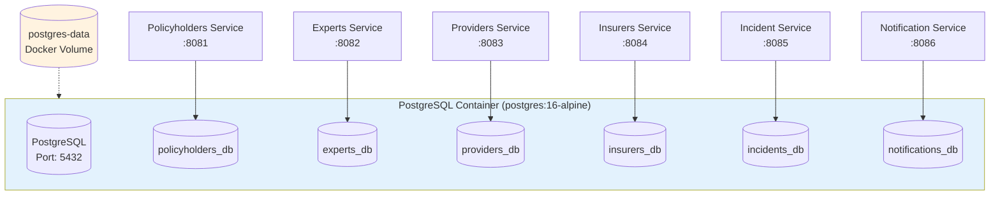

# Database Architecture

## Overview

The IRD0 system uses PostgreSQL 16 as its relational database, with a multi-database architecture that provides data isolation between service instances while maintaining operational simplicity through a single PostgreSQL container.

**Architecture Characteristics:**
- PostgreSQL 16 Alpine (lightweight, production-ready)
- Three isolated databases in a single PostgreSQL container
- UUID primary keys for global uniqueness
- Hibernate ORM with automatic schema management
- HikariCP connection pooling (Spring Boot default)
- Docker volume persistence across container lifecycle

## Multi-Database Setup

### Database Architecture



```
PostgreSQL Container (postgres:16-alpine)
  Port: 5432
  Volume: postgres-data
  │
  ├── policyholders_db → Policyholders Service (port 8081)
  ├── experts_db       → Experts Service (port 8082)
  └── providers_db     → Providers Service (port 8083)
```

**Shared Credentials:**
- Username: `directory_user`
- Password: `directory_pass`
- Note: Should use secrets management in production (e.g., Docker secrets, Kubernetes secrets)

### Database Initialization

**Init Script:** `scripts/init-multiple-databases.sh`

The script runs automatically on container first startup:

```bash
#!/bin/bash
set -e

# Split comma-separated database names from environment variable
IFS=',' read -ra DATABASES <<< "$POSTGRES_MULTIPLE_DATABASES"

# Create each database
for db in "${DATABASES[@]}"; do
  echo "Creating database: $db"
  psql -v ON_ERROR_STOP=1 --username "$POSTGRES_USER" <<-EOSQL
    CREATE DATABASE $db;
    GRANT ALL PRIVILEGES ON DATABASE $db TO $POSTGRES_USER;
EOSQL
done
```

**Triggered By Environment Variable:**

In `docker-compose.yml`:

```yaml
postgres:
  image: postgres:16-alpine
  environment:
    POSTGRES_USER: directory_user
    POSTGRES_PASSWORD: directory_pass
    POSTGRES_MULTIPLE_DATABASES: policyholders_db,experts_db,providers_db
  volumes:
    - ./scripts/init-multiple-databases.sh:/docker-entrypoint-initdb.d/init.sh:ro
    - postgres-data:/var/lib/postgresql/data
```

**Init Script Behavior:**
- Runs only on first container startup (when data volume is empty)
- Creates all three databases sequentially
- Grants full privileges to `directory_user`
- Skips on subsequent starts (databases already exist)

**Verification:**
```bash
# Check databases exist
docker compose exec postgres psql -U directory_user -l

# Should show:
# policyholders_db
# experts_db
# providers_db
```

### Design Rationale

**Why Multi-Database Instead of Single Database?**

**Advantages:**
- **Data Isolation**: Complete separation prevents accidental cross-contamination
- **Security Boundary**: Credential compromise limits blast radius to single database
- **Independent Backup/Restore**: Can backup and restore individual databases
- **Future Sharding**: Database-level partitioning enables future horizontal scaling
- **Testing Isolation**: Integration tests can target specific databases without affecting others
- **Regulatory Compliance**: Different data classifications can have different retention policies

**Trade-offs:**
- **No Cross-Database Queries**: Cannot JOIN policyholders with providers in SQL
- **Transaction Boundaries**: Distributed transactions require application-level coordination
- **Slight Resource Overhead**: Three databases consume more memory than one (minimal impact)

**Why Single Container Instead of Three PostgreSQL Instances?**

**Advantages:**
- **Resource Efficiency**: Single PostgreSQL process uses less memory (~200MB vs ~600MB for three)
- **Operational Simplicity**: One container to manage, monitor, and backup
- **Network Simplicity**: Single connection endpoint
- **Cost**: Lower cloud infrastructure costs (one RDS instance vs three)
- **Development Speed**: Faster local development setup

**Production Considerations:**
- For high-scale production (>100K entries per database), consider separate PostgreSQL instances
- Enables independent resource allocation and scaling
- Current architecture supports small to medium scale effectively

## Connection Configuration

### JDBC Connection URLs

Each Directory Service instance connects to its own database:

**Policyholders Service (policyholders.yml):**
```yaml
spring:
  datasource:
    url: jdbc:postgresql://${POSTGRES_HOST:localhost}:${POSTGRES_PORT:5432}/policyholders_db
    username: ${POSTGRES_USER:directory_user}
    password: ${POSTGRES_PASSWORD:directory_pass}
    driver-class-name: org.postgresql.Driver
```

**Experts Service (experts.yml):**
```yaml
spring:
  datasource:
    url: jdbc:postgresql://${POSTGRES_HOST:localhost}:${POSTGRES_PORT:5432}/experts_db
```

**Providers Service (providers.yml):**
```yaml
spring:
  datasource:
    url: jdbc:postgresql://${POSTGRES_HOST:localhost}:${POSTGRES_PORT:5432}/providers_db
```

**Environment Variables:**
- `POSTGRES_HOST`: Database hostname (default: `localhost` for local dev, `postgres` in Docker network)
- `POSTGRES_PORT`: Database port (default: `5432`)
- `POSTGRES_USER`: Database username (default: `directory_user`)
- `POSTGRES_PASSWORD`: Database password (default: `directory_pass`)

**Docker Compose Configuration:**
```yaml
policyholders:
  environment:
    POSTGRES_HOST: postgres      # Container name in Docker network
    POSTGRES_PORT: 5432
    POSTGRES_USER: directory_user
    POSTGRES_PASSWORD: directory_pass
  depends_on:
    postgres:
      condition: service_healthy  # Wait for PostgreSQL health check
```

### Connection Pooling (HikariCP)

Spring Boot uses HikariCP as the default connection pool (no additional dependency required).

**Default Configuration:**
- Maximum pool size: 10 connections per service instance
- Connection timeout: 30 seconds
- Max lifetime: 30 minutes
- Leak detection threshold: 60 seconds (development)
- Idle timeout: 10 minutes

**Custom Configuration (if needed):**
```yaml
spring:
  datasource:
    hikari:
      maximum-pool-size: 20              # Max connections in pool
      minimum-idle: 5                    # Min idle connections
      connection-timeout: 30000          # Wait time for connection (ms)
      idle-timeout: 600000               # Max idle time before closing (ms)
      max-lifetime: 1800000              # Max lifetime of connection (ms)
      leak-detection-threshold: 60000    # Log if connection held >60s
```

**HikariCP Benefits:**
- Fastest connection pool in Java ecosystem
- Efficient connection management
- Built-in leak detection
- Minimal memory footprint
- Thread-safe

**Pool Sizing Recommendations:**
- Formula: `connections = ((core_count * 2) + effective_spindle_count)`
- For most applications: 10-20 connections sufficient
- Monitor via Actuator metrics: `hikaricp.connections.active`, `hikaricp.connections.idle`

## Schema Management

### Hibernate DDL Auto-Update

The system uses Hibernate to automatically create and update database schemas:

**Configuration (application.yml):**
```yaml
spring:
  jpa:
    hibernate:
      ddl-auto: update              # Auto-create/update schema
    show-sql: true                  # Log SQL statements
    properties:
      hibernate:
        dialect: org.hibernate.dialect.PostgreSQLDialect
        format_sql: true            # Format SQL for readability
```

**DDL Auto Modes:**

| Mode | Behavior | Use Case |
|------|----------|----------|
| `create` | Drop and recreate schema on startup | Never use (data loss) |
| `create-drop` | Create on startup, drop on shutdown | Testing only |
| `update` | Update schema to match entities | Development & Production |
| `validate` | Validate schema matches entities | Production (strict) |
| `none` | No schema management | Manual migrations |

**Current Choice: `update`**
- Adds new tables and columns automatically
- Never drops existing tables or columns
- Safe for production (no data loss)
- Handles entity changes gracefully
- Does NOT handle complex migrations (renames, data transformations)

**Schema Evolution:**

When you add a field to `DirectoryEntry`:

```java
@Entity
public class DirectoryEntry {
    // ... existing fields

    @Column(name = "new_field")
    private String newField;  // New field added
}
```

Hibernate automatically executes on next startup:
```sql
ALTER TABLE directory_entry ADD COLUMN new_field VARCHAR(255);
```

**Limitations:**
- Cannot rename columns (sees as drop + add)
- Cannot change column types directly
- For complex migrations: Use Flyway or Liquibase

### DirectoryEntry Schema

**Entity Definition:**

```java
@Entity
@Table(name = "directory_entry")
public class DirectoryEntry {
    @Id
    @Column(columnDefinition = "uuid", updatable = false, nullable = false)
    private UUID id;

    @Column(name = "name", nullable = false)
    private String name;

    @Column(name = "type", nullable = false, length = 50)
    private String type;

    @Column(name = "email", nullable = false, unique = true)
    private String email;

    @Column(name = "phone", nullable = false, length = 50)
    private String phone;

    @Column(name = "address", columnDefinition = "TEXT")
    private String address;

    @Column(name = "additional_info", columnDefinition = "TEXT")
    private String additionalInfo;

    @PrePersist
    public void generateId() {
        if (this.id == null) {
            this.id = UUID.randomUUID();
        }
    }
}
```

**Generated SQL Schema:**

```sql
CREATE TABLE directory_entry (
    id UUID PRIMARY KEY,
    name VARCHAR(255) NOT NULL,
    type VARCHAR(50) NOT NULL,
    email VARCHAR(255) NOT NULL UNIQUE,
    phone VARCHAR(50) NOT NULL,
    address TEXT,
    additional_info TEXT
);
```

**Indexes:**
- Primary key index on `id` (UUID) - automatically created
- Unique index on `email` - enforces email uniqueness
- Additional indexes can be added via `@Index` annotation

**Field Mapping:**

| Java Field | SQL Column | Type | Constraints |
|------------|------------|------|-------------|
| `id` | `id` | UUID | PRIMARY KEY, NOT NULL |
| `name` | `name` | VARCHAR(255) | NOT NULL |
| `type` | `type` | VARCHAR(50) | NOT NULL |
| `email` | `email` | VARCHAR(255) | NOT NULL, UNIQUE |
| `phone` | `phone` | VARCHAR(50) | NOT NULL |
| `address` | `address` | TEXT | NULL |
| `additionalInfo` | `additional_info` | TEXT | NULL |

### PostgreSQL Dialect

**Configuration:**
```yaml
spring:
  jpa:
    properties:
      hibernate:
        dialect: org.hibernate.dialect.PostgreSQLDialect
```

**Included in Hibernate Core:**
- No additional dependency required
- Part of `spring-boot-starter-data-jpa`
- Optimizes SQL for PostgreSQL-specific features

**PostgreSQL-Specific Optimizations:**
- Native UUID type support
- Efficient BOOLEAN mapping
- TEXT type for unlimited strings
- JSON/JSONB support (if needed)
- Array type support (if needed)
- Full-text search functions
- Window functions

**Example Generated SQL:**
```sql
-- INSERT with RETURNING (PostgreSQL-specific)
INSERT INTO directory_entry (name, type, email, phone, address, additional_info, id)
VALUES (?, ?, ?, ?, ?, ?, ?)
RETURNING id;

-- ON CONFLICT for upserts (PostgreSQL 9.5+)
INSERT INTO directory_entry (id, name, type, email, phone, address, additional_info)
VALUES (?, ?, ?, ?, ?, ?, ?)
ON CONFLICT (email) DO UPDATE
SET name = EXCLUDED.name,
    type = EXCLUDED.type,
    phone = EXCLUDED.phone,
    address = EXCLUDED.address,
    additional_info = EXCLUDED.additional_info;
```

## UUID Primary Keys

### Implementation

**Entity Configuration:**
```java
@Entity
public class DirectoryEntry {
    @Id
    @Column(columnDefinition = "uuid", updatable = false, nullable = false)
    private UUID id;

    @PrePersist
    public void generateId() {
        if (this.id == null) {
            this.id = UUID.randomUUID();
        }
    }
}
```

**Generation Strategy:**
- **Application-Generated**: UUIDs created by Java application (not database)
- **Timing**: Generated via `@PrePersist` lifecycle hook (before INSERT)
- **Algorithm**: `UUID.randomUUID()` uses Type 4 (random) UUIDs
- **Format**: Standard 36-character format: `c9088e6f-86a4-4001-9a6a-554510787dd9`

**PostgreSQL Storage:**
- Native `uuid` type (128-bit, 16 bytes)
- More efficient than storing as VARCHAR(36) (36 bytes)
- Indexed as binary data (faster comparisons)
- Supports standard PostgreSQL UUID functions

### Benefits of UUIDs

**1. Global Uniqueness:**
- No coordination needed between service instances
- Can generate IDs offline
- Merging data from multiple sources is trivial

**2. Security:**
- No sequential enumeration (can't guess valid IDs)
- Obscures database size (no ID=1, ID=2 sequence)
- Prevents information disclosure through ID patterns

**3. Distributed-Friendly:**
- No single point of failure (auto-increment requires coordination)
- Enables offline data creation
- Supports eventual consistency models

**4. Merge-Friendly:**
- No ID conflicts when merging databases
- Simplifies multi-datacenter deployments
- Enables data synchronization across systems

**5. Future-Proof:**
- Supports sharding without ID reassignment
- Enables cross-system data exchange
- Compatible with event sourcing patterns

### Trade-offs of UUIDs

**Storage Overhead:**
- UUID: 128 bits (16 bytes)
- BIGINT: 64 bits (8 bytes)
- Impact: ~2x primary key storage, ~2x foreign key storage

**Index Performance:**
- UUIDs are random (not sequential)
- B-tree index fragmentation higher than sequential IDs
- PostgreSQL UUID type mitigates this somewhat
- Impact: Slightly slower INSERT performance (~5-10%)

**Human Readability:**
- UUIDs are not human-friendly: `c9088e6f-86a4-4001-9a6a-554510787dd9`
- BIGINT is easier to reference: `12345`
- Mitigation: Use email or name for human reference

**Comparison:**

| Aspect | UUID | BIGINT |
|--------|------|--------|
| Storage | 16 bytes | 8 bytes |
| Uniqueness | Global | Database-scoped |
| Generation | Application | Database sequence |
| Performance | Slightly slower inserts | Fast inserts |
| Security | No enumeration | Sequential, guessable |
| Distribution | Excellent | Requires coordination |
| Human-Friendly | No | Yes |

**When to Use UUIDs:**
- Multi-instance deployments (✓ our use case)
- Distributed systems
- Data synchronization needs
- Security requirements (no ID enumeration)
- Future sharding plans

**When to Use BIGINT:**
- Single-database systems
- Performance-critical inserts
- Human-readable IDs required
- Storage constraints

### Migration from Long to UUID

The system previously used `Long` (BIGINT) primary keys and migrated to UUIDs. See [migrations/uuid-migration.md](../migrations/uuid-migration.md) for complete migration details.

**Migration Highlights:**
- Breaking change: API endpoints changed (`/api/policyholders/1` → `/api/policyholders/c9088e6f-...`)
- Data not preserved: Migration required fresh database
- Performance impact: Negligible for current scale (<100K entries)

## Transaction Management

### Spring @Transactional

Directory services use Spring's declarative transaction management:

**Service Layer Transactions:**
```java
@Service
public class DirectoryEntryService {

    @Transactional
    public DirectoryEntry create(DirectoryEntry entry) {
        return repository.save(entry);
    }

    @Transactional
    public DirectoryEntry update(UUID id, DirectoryEntry entry) {
        DirectoryEntry existing = repository.findById(id)
            .orElseThrow(() -> new RuntimeException("Not found"));
        // Update fields
        return repository.save(existing);
    }

    @Transactional
    public void delete(UUID id) {
        repository.deleteById(id);
    }
}
```

**Transaction Characteristics:**
- **Isolation Level**: `READ_COMMITTED` (PostgreSQL default)
- **Propagation**: `REQUIRED` (join existing or create new)
- **Rollback**: Automatic on unchecked exceptions
- **Read-Only**: Not set (allows writes)

**Batch Processing Transactions:**

CSV import uses batched transactions:

```java
@Transactional
public ImportResult importBatch(List<DirectoryEntry> batch) {
    // Process entire batch in single transaction
    // Rollback all if any row fails (configurable)
}
```

**Transaction Boundaries:**
- Each batch (500 rows) is a separate transaction
- Partial failure: Failed rows logged, successful rows committed
- No rollback of entire import on single row failure

### Isolation Levels

**Current Level: READ_COMMITTED (PostgreSQL default)**

**Characteristics:**
- Reads only committed data
- Prevents dirty reads
- Allows non-repeatable reads
- Allows phantom reads
- Good balance of consistency and performance

**Other Levels Available:**

| Level | Dirty Reads | Non-Repeatable Reads | Phantom Reads |
|-------|-------------|----------------------|---------------|
| READ_UNCOMMITTED | Yes | Yes | Yes |
| READ_COMMITTED (default) | No | Yes | Yes |
| REPEATABLE_READ | No | No | Yes |
| SERIALIZABLE | No | No | No |

**Changing Isolation Level:**
```java
@Transactional(isolation = Isolation.SERIALIZABLE)
public void criticalOperation() {
    // Highest consistency, lowest concurrency
}
```

## Database Persistence

### Docker Volume Strategy

**Named Volume: `postgres-data`**

Configuration in `docker-compose.yml`:
```yaml
postgres:
  image: postgres:16-alpine
  volumes:
    - postgres-data:/var/lib/postgresql/data

volumes:
  postgres-data:
    driver: local
```

**Persistence Behavior:**
- Volume persists across container restarts
- Volume persists across `docker compose down`
- Volume persists across `docker compose up --build` (rebuilds)
- Volume removed only with `docker compose down -v` (explicit volume removal)

**Volume Location:**
- Managed by Docker (not in project directory)
- Location: `/var/lib/docker/volumes/ird0_postgres-data/_data` (Linux)
- View: `docker volume inspect ird0_postgres-data`

**Data Lifecycle:**

| Command | Container | Data Volume |
|---------|-----------|-------------|
| `docker compose down` | Removed | **Persists** |
| `docker compose down -v` | Removed | **Removed** |
| `docker compose up` | Recreated | Reattached |
| `docker compose restart` | Restarted | **Persists** |

**Benefits:**
- Data survives container recreation
- Data survives system reboots
- Decouples data from container lifecycle
- Enables container upgrades without data loss

### Backup Strategy

**For operational backup procedures, see [USER_GUIDE.md#backup-and-restore](../USER_GUIDE.md#backup-and-restore)**

**Backup Methods:**

**1. pg_dump (Logical Backup):**
```bash
# Backup single database
docker compose exec postgres pg_dump -U directory_user policyholders_db > backup.sql

# Backup all databases
docker compose exec postgres pg_dumpall -U directory_user > full_backup.sql
```

**2. Docker Volume Backup:**
```bash
# Backup volume to tar archive
docker run --rm \
  -v ird0_postgres-data:/data \
  -v $(pwd):/backup \
  alpine tar czf /backup/postgres-data-backup.tar.gz -C /data .
```

**Restore:**
```bash
# Restore from pg_dump
docker compose exec -T postgres psql -U directory_user policyholders_db < backup.sql

# Restore volume from tar
docker run --rm \
  -v ird0_postgres-data:/data \
  -v $(pwd):/backup \
  alpine tar xzf /backup/postgres-data-backup.tar.gz -C /data
```

## Performance Considerations

### Connection Pooling

**Monitoring:**
```bash
# Actuator metrics
curl http://localhost:8081/actuator/metrics/hikaricp.connections.active
curl http://localhost:8081/actuator/metrics/hikaricp.connections.idle
curl http://localhost:8081/actuator/metrics/hikaricp.connections.pending
```

**Tuning Guidelines:**
- Monitor `hikaricp.connections.pending` (should be 0)
- If `active` constantly equals `maximum-pool-size`, increase pool size
- If `idle` always high, decrease `maximum-pool-size`
- Typical: 10-20 connections per service instance

### UUID Index Performance

**Impact:**
- UUID primary key index is slightly larger than BIGINT
- Random UUIDs cause more index page splits
- Impact minimal for current scale (<100K entries)

**Optimization:**
- PostgreSQL UUID type is efficient (128-bit binary)
- Consider UUIDv7 for sequential UUIDs (future enhancement)
- Monitor index bloat: `pg_stat_user_indexes`

### Query Performance

**SQL Logging:**
```yaml
spring:
  jpa:
    show-sql: true
    properties:
      hibernate:
        format_sql: true
        use_sql_comments: true
```

**N+1 Query Prevention:**
- Use `@EntityGraph` for eager fetching
- Use `JOIN FETCH` in JPQL queries
- Monitor with `hibernate.generate_statistics: true`

**Indexes:**
- Primary key (id): Automatic B-tree index
- Unique constraint (email): Automatic unique index
- Additional indexes: Add via `@Index` annotation on entity

**Query Plan Analysis:**
```sql
EXPLAIN ANALYZE SELECT * FROM directory_entry WHERE email = 'john@example.com';
```

## Related Topics

- [USER_GUIDE.md#database-management](../USER_GUIDE.md#database-management) - Operational procedures
- [configuration.md](configuration.md) - Database configuration details
- [docker.md](docker.md) - Docker volume management
- [migrations/uuid-migration.md](../migrations/uuid-migration.md) - UUID migration guide
- [ARCHITECTURE.md](../ARCHITECTURE.md) - Overall system architecture

## References

- [PostgreSQL 16 Documentation](https://www.postgresql.org/docs/16/)
- [Hibernate ORM Documentation](https://hibernate.org/orm/documentation/6.0/)
- [HikariCP Documentation](https://github.com/brettwooldridge/HikariCP)
- [Spring Data JPA Reference](https://docs.spring.io/spring-data/jpa/docs/current/reference/html/)
