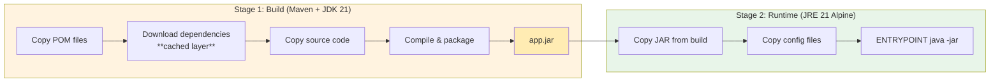

# Docker & Containerization

## Overview

The IRD0 system uses Docker multi-stage builds with optimized layer caching to minimize build times and image sizes. All services are orchestrated using Docker Compose for local development and deployment.

**Key Features:**
- Multi-stage builds (build stage + runtime stage)
- Dependency layer caching (saves ~60-70 seconds per build)
- Minimal runtime images (Alpine-based JRE)
- Configuration injection via build args
- Named volumes for data persistence
- Health checks and service dependencies

## Multi-Stage Build Architecture

### Overview

All services use a consistent two-stage Dockerfile pattern:



```
Stage 1: Build (Maven + JDK 21)
├── Copy POM files
├── Download dependencies (cached layer)
├── Copy source code
└── Compile and package

Stage 2: Runtime (JRE 21 Alpine)
├── Copy executable JAR from build stage
├── Copy configuration files
└── Run application
```

**Benefits:**
- Small runtime images (~200MB vs ~600MB with Maven)
- Fast incremental builds (dependency cache)
- No build tools in production image (security)
- Clear separation of concerns

### Directory Service Dockerfile

**Location:** `microservices/directory/Dockerfile`

**Full Dockerfile:**

```dockerfile
# ---------- Stage 1: Build with Maven ----------
FROM maven:3.9.5-eclipse-temurin-21 AS build

WORKDIR /app

# Copy only POM files first (for dependency caching)
COPY pom.xml .
COPY microservices/directory/pom.xml ./microservices/directory/

# Download all dependencies (this layer is cached and reused across all 3 services)
# This creates a separate Docker layer that only invalidates when POM files change
RUN mvn -f microservices/directory/pom.xml dependency:resolve dependency:resolve-plugins -B

# Copy source code (changes here won't invalidate dependency cache)
COPY microservices/directory/src ./microservices/directory/src

# Compile the project and create the jar (dependencies already downloaded)
RUN mvn -f microservices/directory/pom.xml package -DskipTests

# ---------- Stage 2: Final image ----------
FROM eclipse-temurin:21-jdk-alpine

ARG APP_YML=application.yml
WORKDIR /app

# Copy the executable jar from the build stage
COPY --from=build /app/microservices/directory/target/directory-1.0.0-exec.jar app.jar

# Copy common configuration
COPY microservices/directory/configs/application.yml application.yml

# Copy instance-specific configuration
COPY microservices/directory/configs/${APP_YML} instance.yml

ENTRYPOINT ["java", "-jar", "app.jar", "--spring.config.location=file:/app/application.yml,file:/app/instance.yml"]
```

### Stage 1: Build Stage

**Base Image:** `maven:3.9.5-eclipse-temurin-21`
- Includes Maven 3.9.5
- Includes JDK 21 (full JDK for compilation)
- Based on Eclipse Temurin (formerly AdoptOpenJDK)
- Size: ~450MB

**Layer 1: POM Files (Rarely Changes)**
```dockerfile
COPY pom.xml .
COPY microservices/directory/pom.xml ./microservices/directory/
```

**Why Copy POMs First?**
- POM files change infrequently (only on dependency updates)
- Creates a cacheable layer that persists across source code changes
- Subsequent builds reuse this layer if POMs haven't changed

**Layer 2: Dependency Resolution (Cached)**
```dockerfile
RUN mvn -f microservices/directory/pom.xml dependency:resolve dependency:resolve-plugins -B
```

**This is the key optimization:**
- Downloads all Maven dependencies (~100-200MB)
- Downloads all Maven plugins
- Layer is cached by Docker
- Only invalidates when POM files change
- Saves ~60-70 seconds per build after first build
- Shared across all three directory service instances

**Flags:**
- `-f microservices/directory/pom.xml`: Specify POM file location
- `dependency:resolve`: Download compile and runtime dependencies
- `dependency:resolve-plugins`: Download plugin dependencies
- `-B`: Batch mode (non-interactive, less verbose output)

**Layer 3: Source Code (Changes Frequently)**
```dockerfile
COPY microservices/directory/src ./microservices/directory/src
```

**Why Copy Source Last?**
- Source code changes frequently during development
- Invalidating this layer doesn't affect dependency cache above
- Fast rebuilds: Only compilation, no dependency downloads

**Layer 4: Compilation (Fast with Cache)**
```dockerfile
RUN mvn -f microservices/directory/pom.xml package -DskipTests
```

**Compilation:**
- Compiles Java source code
- Packages into executable JAR
- Skips tests (`-DskipTests`) for faster builds
- Fast because dependencies already downloaded
- Output: `target/directory-1.0.0-exec.jar` (~65MB)

### Stage 2: Runtime Stage

**Base Image:** `eclipse-temurin:21-jdk-alpine`
- JDK 21 (full JDK, can use JRE for smaller size)
- Alpine Linux (minimal, secure)
- Size: ~175MB base + ~65MB JAR = ~240MB final

**Why Alpine?**
- Minimal Linux distribution (~5MB base)
- Security-focused (reduced attack surface)
- Fast to download and deploy
- Industry standard for containerized Java apps

**Build Argument: APP_YML**
```dockerfile
ARG APP_YML=application.yml
```

**Purpose:**
- Selects which configuration file to inject
- Set by Docker Compose during build
- Enables multi-instance pattern (same Dockerfile, different configs)

**Examples:**
- `policyholders`: `APP_YML=policyholders.yml`
- `experts`: `APP_YML=experts.yml`
- `providers`: `APP_YML=providers.yml`

**Copy Executable JAR**
```dockerfile
COPY --from=build /app/microservices/directory/target/directory-1.0.0-exec.jar app.jar
```

**Copy Configuration Files**
```dockerfile
COPY microservices/directory/configs/application.yml application.yml
COPY microservices/directory/configs/${APP_YML} instance.yml
```

**Configuration Loading Order:**
1. `application.yml` - Common configuration (all instances)
2. `instance.yml` - Instance-specific overrides (policyholders, experts, providers)

**Entry Point**
```dockerfile
ENTRYPOINT ["java", "-jar", "app.jar", "--spring.config.location=file:/app/application.yml,file:/app/instance.yml"]
```

**Flags:**
- `java -jar app.jar`: Run Spring Boot executable JAR
- `--spring.config.location`: Override default config locations
- Comma-separated: Load both files in order

## Dependency Layer Caching Strategy

### How It Works

**Docker Layer Caching:**

Docker caches each instruction (`RUN`, `COPY`, `ADD`) as a separate layer. If a layer hasn't changed, Docker reuses the cached layer instead of executing the instruction.

**Cache Invalidation:**

A layer is invalidated (rebuilt) when:
- The instruction changes
- Files copied in the instruction change
- A previous layer was invalidated

**Our Strategy:**

```
Layer 1: COPY pom.xml                     ← Rarely changes
Layer 2: RUN mvn dependency:resolve       ← Cached, reused (key optimization!)
Layer 3: COPY src/                        ← Changes frequently
Layer 4: RUN mvn package                  ← Fast (dependencies already present)
```

**First Build (No Cache):**
```
Step 1: Copy POMs (1s)
Step 2: Download dependencies (60-70s) ← Slow
Step 3: Copy source (1s)
Step 4: Compile (15-20s)
Total: ~90 seconds
```

**Subsequent Build (Source Changed, POMs Unchanged):**
```
Step 1: Copy POMs (cached, 0s)
Step 2: Download dependencies (cached, 0s) ← Fast!
Step 3: Copy source (1s)
Step 4: Compile (15-20s)
Total: ~20 seconds
```

**Subsequent Build (POMs Changed):**
```
Step 1: Copy POMs (1s)
Step 2: Download dependencies (60-70s) ← Re-download
Step 3: Copy source (1s)
Step 4: Compile (15-20s)
Total: ~90 seconds
```

### Cross-Service Efficiency

**All Three Directory Instances Share Dependency Layer:**

When building all three services:

**Without Caching:**
```
Policyholders: 90s (download deps)
Experts:       90s (download deps)
Providers:     90s (download deps)
Total:         270s
```

**With Caching (after first build):**
```
Policyholders: 90s (download deps, create cache)
Experts:       20s (reuse cache)
Providers:     20s (reuse cache)
Total:         130s
```

**Savings:** ~140 seconds (~52% reduction)

**Why Shared?**
- Same POM files across all three instances
- Same dependencies (Spring Boot, PostgreSQL, etc.)
- Docker caches by content hash (same POMs = same cache)

### Best Practices

**DO:**
- Copy dependency metadata first (pom.xml, package.json, etc.)
- Separate dependency download from source copy
- Use `.dockerignore` to exclude unnecessary files
- Order layers from least to most frequently changing

**DON'T:**
- Copy source before downloading dependencies
- Copy entire project directory in one COPY command
- Include target/ or build/ directories in COPY commands
- Change POMs unnecessarily (invalidates expensive cache)

## APP_YML Build Arg Pattern

### Purpose

Enables multi-instance deployment from a single Dockerfile:
- Same codebase
- Same Docker image build process
- Different runtime configurations

### Docker Compose File Organization

The project uses a modular Docker Compose configuration split across multiple files for improved maintainability and selective service startup:

**File Structure:**
```
docker-compose.yml                      # Main orchestration file (includes all groups)
docker-compose.infrastructure.yml       # Core infrastructure (postgres, vault, networks, volumes)
docker-compose.directory.yml            # Directory microservices (4 instances)
docker-compose.apps.yml                 # Application services (incident, notification, sftp)
```

**Main Orchestration File (docker-compose.yml):**
```yaml
# Main Docker Compose orchestration file
# This file includes all service groups using the include directive

include:
  - docker-compose.infrastructure.yml
  - docker-compose.directory.yml
  - docker-compose.apps.yml
```

**Benefits of Modular Structure:**
- Easier navigation and maintenance (each file ~100-150 lines)
- Related services grouped together
- Selective service startup (infrastructure only, directory only, etc.)
- Users can still run `docker compose up` without additional flags
- Clear separation of concerns (infrastructure vs application services)

**Usage Examples:**
```bash
# Start all services (uses main docker-compose.yml with includes)
docker compose up -d

# Start infrastructure only (postgres + vault)
docker compose -f docker-compose.infrastructure.yml up -d

# Start infrastructure + directory services
docker compose -f docker-compose.infrastructure.yml -f docker-compose.directory.yml up -d

# View merged configuration
docker compose config
```

**Include Directive:**
The `include` directive (available since Docker Compose v2.20) allows the main file to reference other compose files. Docker automatically merges them, resolving cross-file dependencies and network references.

### Docker Compose Service Configuration

**Example: Policyholders Service (from docker-compose.directory.yml)**

```yaml
policyholders-svc:
  build:
    context: .
    dockerfile: microservices/directory/Dockerfile
    args:
      APP_YML: policyholders.yml    # Inject policyholders config
  image: directory-policyholders
  ports:
    - "${POLICYHOLDERS_HOST_PORT}:${SERVICE_INTERNAL_PORT}"  # 8081:8080
  environment:
    - SERVER_PORT=${SERVICE_INTERNAL_PORT}
    - POSTGRES_HOST=${POSTGRES_HOST}
    - POSTGRES_USER=${POSTGRES_USER}
    - POSTGRES_PASSWORD=${POSTGRES_PASSWORD}
  depends_on:
    postgres:
      condition: service_healthy
  networks:
    insurance-network:
      aliases:
        - ${POLICYHOLDERS_SERVICE_HOST}  # Creates 'policyholders' DNS alias
```

**Example: Infrastructure Services (from docker-compose.infrastructure.yml)**

```yaml
postgres:
  image: postgres:16-alpine
  environment:
    POSTGRES_USER: ${POSTGRES_USER}
    POSTGRES_PASSWORD: ${POSTGRES_PASSWORD}
    POSTGRES_MULTIPLE_DATABASES: policyholders_db,experts_db,providers_db,insurers_db
  volumes:
    - postgres-data:/var/lib/postgresql/data
  healthcheck:
    test: ["CMD-SHELL", "pg_isready -U directory_user"]
    interval: 10s
  networks:
    - insurance-network

volumes:
  postgres-data:
    driver: local

networks:
  insurance-network:
    driver: bridge
```

**Cross-File Dependencies:**
Services can depend on resources defined in other compose files. Docker Compose automatically resolves these when using the main docker-compose.yml or when combining multiple files with `-f` flags.

### Build-Time vs Runtime Configuration

**Build-Time (Baked into Image):**
- Configuration files embedded in Docker image
- Cannot change without rebuilding image
- Suitable for: Instance type (policyholders/experts/providers)

**Runtime (Environment Variables):**
- Database credentials
- External service URLs
- Feature flags
- Suitable for: Environment-specific settings (dev/staging/prod)

**Combined Approach:**

```yaml
policyholders:
  build:
    args:
      APP_YML: policyholders.yml    # Build-time: Instance type
  environment:
    POSTGRES_HOST: postgres          # Runtime: Database host
    POSTGRES_PASSWORD: ${DB_PASS}    # Runtime: Secret
```

**Configuration Priority:**
1. Command-line arguments (highest)
2. Environment variables
3. `instance.yml` (APP_YML)
4. `application.yml` (lowest)

## Volume Management

### Named Volumes

**PostgreSQL Data Volume:**

```yaml
volumes:
  postgres-data:
    driver: local

services:
  postgres:
    volumes:
      - postgres-data:/var/lib/postgresql/data
```

**Characteristics:**
- Managed by Docker (not in project directory)
- Persists across container restarts and rebuilds
- Persists across `docker compose down`
- Removed only with `docker compose down -v` (explicit)
- Can be backed up with `docker volume` commands

**Benefits:**
- Data survives container recreation
- Data survives system reboots
- Decouples data from container lifecycle
- Enables container upgrades without data loss

**Location:**
```bash
# Inspect volume
docker volume inspect ird0_postgres-data

# Location (Linux)
/var/lib/docker/volumes/ird0_postgres-data/_data
```

### Bind Mounts

**SSH Keys (Read-Write):**

```yaml
services:
  policyholders:
    volumes:
      - ./keys:/app/keys              # Read-write
```

**Purpose:**
- Persistent SSH keys across container restarts
- Keys generated once, reused on subsequent runs
- Host can manage keys directly

**CSV Data Files (Read-Only):**

```yaml
services:
  sftp-server:
    volumes:
      - ./data:/app/data:ro           # Read-only
```

**Purpose:**
- SFTP server exposes local `./data` directory
- Read-only prevents SFTP clients from modifying files
- Host updates files, container serves them

**Init Scripts (Read-Only):**

```yaml
services:
  postgres:
    volumes:
      - ./scripts/init-multiple-databases.sh:/docker-entrypoint-initdb.d/init.sh:ro
```

**Purpose:**
- PostgreSQL runs init scripts on first startup
- Read-only prevents container from modifying script

### Volume vs Bind Mount

| Aspect | Named Volume | Bind Mount |
|--------|--------------|------------|
| **Location** | Docker-managed | Host filesystem path |
| **Persistence** | Survives container deletion | Tied to host path |
| **Portability** | Platform-independent | Path must exist on host |
| **Performance** | Optimized by Docker | Native filesystem speed |
| **Backup** | `docker volume` commands | Standard file backup |
| **Use Case** | Database data, caches | Config files, dev files |

**When to Use Named Volumes:**
- Database data files
- Application state
- Caches
- Anything Docker-managed

**When to Use Bind Mounts:**
- Configuration files
- Source code (development)
- Keys and secrets
- Anything host-managed

## Network Configuration

### Docker Compose Network

Docker Compose creates a default network for all services:

```yaml
services:
  policyholders:
    # Automatically joins default network
  postgres:
    # Automatically joins default network
  sftp-server:
    # Automatically joins default network
```

**Network Name:** `ird0_default` (project name + `_default`)

**Service Resolution:**
- Services discover each other by service name
- `postgres` resolves to PostgreSQL container IP
- `sftp-server` resolves to SFTP server container IP
- No manual IP management needed

**Example:**

Policyholders service connects to PostgreSQL:

```yaml
environment:
  POSTGRES_HOST: postgres    # Resolves via Docker DNS
```

Spring Boot configuration:
```yaml
spring:
  datasource:
    url: jdbc:postgresql://postgres:5432/policyholders_db
```

### Port Mapping

**PostgreSQL:**
```yaml
postgres:
  ports:
    - "5432:5432"    # Host:Container
```

- Host port `5432` maps to container port `5432`
- Accessible from host: `localhost:5432`
- Accessible from other containers: `postgres:5432`

**Directory Services:**
```yaml
policyholders:
  ports:
    - "8081:8081"    # External:Internal
```

**SFTP Server:**
```yaml
sftp-server:
  ports:
    - "2222:2222"    # SFTP protocol
    - "9090:9090"    # Actuator management
```

**Port Conflicts:**
- If host port already in use, change left side only
- Example: `"8091:8081"` maps host 8091 to container 8081

## Service Dependencies and Health Checks

### Health Checks

**PostgreSQL Health Check:**

```yaml
postgres:
  healthcheck:
    test: ["CMD-SHELL", "pg_isready -U directory_user"]
    interval: 10s
    timeout: 5s
    retries: 5
```

**How It Works:**
- Runs `pg_isready` command every 10 seconds
- Marks service healthy when command succeeds
- Retries up to 5 times
- Other services wait for healthy status

**Test Command:**
- `CMD-SHELL`: Run shell command
- `pg_isready`: PostgreSQL utility to test connection
- `-U directory_user`: Test as specific user

### Service Dependencies

**Policyholders Service:**

```yaml
policyholders:
  depends_on:
    postgres:
      condition: service_healthy    # Wait for healthy status
    sftp-server:
      condition: service_started    # Wait for start only
```

**Dependency Conditions:**

| Condition | Meaning |
|-----------|---------|
| `service_started` | Wait for container to start |
| `service_healthy` | Wait for health check to pass |
| `service_completed_successfully` | Wait for one-shot task to complete |

**Start Order:**

```
1. postgres (starts, runs health check)
     ↓
2. postgres becomes healthy
     ↓
3. policyholders, experts, providers start
4. sftp-server starts
```

**Why Health Checks Matter:**
- Prevents "connection refused" errors on startup
- Ensures database is ready before apps connect
- Enables zero-downtime restarts (future: rolling deploys)

## Dockerfile Optimization Techniques

### 1. Minimize Layers

**Bad:**
```dockerfile
RUN apt-get update
RUN apt-get install -y package1
RUN apt-get install -y package2
```

**Good:**
```dockerfile
RUN apt-get update && \
    apt-get install -y package1 package2 && \
    rm -rf /var/lib/apt/lists/*
```

**Benefit:** Fewer layers = smaller image

### 2. Order Layers by Change Frequency

**Bad:**
```dockerfile
COPY src/ /app/src/
COPY pom.xml /app/
RUN mvn package
```

**Good:**
```dockerfile
COPY pom.xml /app/
RUN mvn dependency:resolve    # Cached
COPY src/ /app/src/          # Changes frequently
RUN mvn package               # Fast (deps cached)
```

### 3. Use .dockerignore

**`.dockerignore` File:**
```
target/
.git/
.idea/
*.md
.DS_Store
node_modules/
```

**Benefit:**
- Faster COPY operations
- Smaller build context
- Prevents cache invalidation from ignored files

### 4. Multi-Stage for Small Images

**Bad (Single Stage):**
```dockerfile
FROM maven:3.9-openjdk-21
COPY . .
RUN mvn package
ENTRYPOINT ["java", "-jar", "target/app.jar"]
# Image size: ~600MB
```

**Good (Multi-Stage):**
```dockerfile
FROM maven:3.9-openjdk-21 AS build
COPY . .
RUN mvn package

FROM eclipse-temurin:21-jre-alpine
COPY --from=build /app/target/app.jar app.jar
ENTRYPOINT ["java", "-jar", "app.jar"]
# Image size: ~200MB
```

### 5. Use Specific Tags

**Bad:**
```dockerfile
FROM maven:latest    # Unpredictable
```

**Good:**
```dockerfile
FROM maven:3.9.5-eclipse-temurin-21    # Reproducible
```

**Benefit:**
- Reproducible builds
- Prevents unexpected breakage
- Clear dependency versions

## Common Docker Commands

**For operational Docker commands, see [USER_GUIDE.md#service-operations](../USER_GUIDE.md#service-operations)**

**Build and Run:**
```bash
# Build all services
docker compose build

# Build specific service
docker compose build policyholders

# Run all services
docker compose up

# Run in background
docker compose up -d

# Run specific service
docker compose up policyholders
```

**View Logs:**
```bash
# All services
docker compose logs -f

# Specific service
docker compose logs -f policyholders

# Last 100 lines
docker compose logs --tail=100 policyholders
```

**Stop and Remove:**
```bash
# Stop containers (keeps volumes)
docker compose down

# Stop and remove volumes (deletes data)
docker compose down -v

# Stop single service
docker compose stop policyholders
```

**Rebuild:**
```bash
# Rebuild single service
docker compose build policyholders
docker compose up policyholders

# Force rebuild (no cache)
docker compose build --no-cache policyholders
```

**Execute Commands:**
```bash
# Shell in running container
docker compose exec policyholders sh

# Run one-off command
docker compose exec policyholders java -version

# PostgreSQL shell
docker compose exec postgres psql -U directory_user -d policyholders_db
```

## Related Topics

- [USER_GUIDE.md#service-operations](../USER_GUIDE.md#service-operations) - Operational procedures
- [configuration.md](configuration.md) - Configuration management
- [database.md](database.md) - Database persistence and volumes
- [ARCHITECTURE.md](../ARCHITECTURE.md) - Overall system architecture

## References

- [Docker Multi-Stage Builds](https://docs.docker.com/build/building/multi-stage/)
- [Docker Compose Documentation](https://docs.docker.com/compose/)
- [Dockerfile Best Practices](https://docs.docker.com/develop/develop-images/dockerfile_best-practices/)
- [Docker Layer Caching](https://docs.docker.com/build/cache/)
