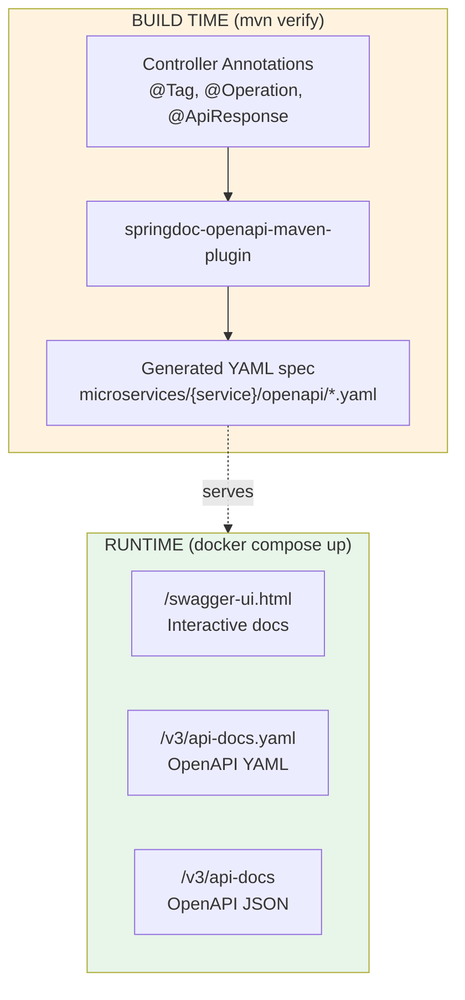

# OpenAPI Integration

This document describes the OpenAPI 3.1 integration for automatic API documentation generation and Swagger UI deployment.

## Overview

The project uses **SpringDoc OpenAPI** to:
1. Generate OpenAPI specifications from controller annotations at build time
2. Provide interactive Swagger UI at runtime for API exploration and testing

## Architecture



```
┌─────────────────────────────────────────────────────────────────┐
│                    BUILD TIME (mvn verify)                       │
├─────────────────────────────────────────────────────────────────┤
│  Controller Annotations (@Tag, @Operation, @ApiResponse)         │
│           ↓                                                      │
│  springdoc-openapi-maven-plugin                                  │
│  (starts app, fetches /v3/api-docs.yaml, stops app)             │
│           ↓                                                      │
│  microservices/{service}/openapi/{service}-api.yaml              │
└─────────────────────────────────────────────────────────────────┘

┌─────────────────────────────────────────────────────────────────┐
│                    RUNTIME (docker compose up)                   │
├─────────────────────────────────────────────────────────────────┤
│  /swagger-ui.html  →  Interactive API documentation              │
│  /v3/api-docs.yaml →  OpenAPI spec (YAML)                        │
│  /v3/api-docs      →  OpenAPI spec (JSON)                        │
└─────────────────────────────────────────────────────────────────┘
```

## Dependencies

### Parent POM (pom.xml)

```xml
<properties>
    <springdoc.version>2.8.4</springdoc.version>
</properties>

<dependencyManagement>
    <dependency>
        <groupId>org.springdoc</groupId>
        <artifactId>springdoc-openapi-starter-webmvc-ui</artifactId>
        <version>${springdoc.version}</version>
    </dependency>
</dependencyManagement>

<pluginManagement>
    <plugin>
        <groupId>org.springdoc</groupId>
        <artifactId>springdoc-openapi-maven-plugin</artifactId>
        <version>1.4</version>
    </plugin>
</pluginManagement>
```

### Service POM (microservices/{service}/pom.xml)

```xml
<dependencies>
    <dependency>
        <groupId>org.springdoc</groupId>
        <artifactId>springdoc-openapi-starter-webmvc-ui</artifactId>
    </dependency>
</dependencies>

<build>
    <plugins>
        <plugin>
            <groupId>org.springdoc</groupId>
            <artifactId>springdoc-openapi-maven-plugin</artifactId>
            <executions>
                <execution>
                    <id>generate-openapi</id>
                    <phase>integration-test</phase>
                    <goals>
                        <goal>generate</goal>
                    </goals>
                </execution>
            </executions>
            <configuration>
                <apiDocsUrl>http://localhost:8081/v3/api-docs.yaml</apiDocsUrl>
                <outputFileName>directory-api.yaml</outputFileName>
                <outputDir>${project.basedir}/openapi</outputDir>
            </configuration>
        </plugin>
    </plugins>
</build>
```

## Configuration

### Application YAML (configs/application.yml)

```yaml
springdoc:
  api-docs:
    enabled: true
    path: /v3/api-docs
  swagger-ui:
    enabled: true
    path: /swagger-ui.html
    operationsSorter: method      # Sort operations by HTTP method
    tagsSorter: alpha             # Sort tags alphabetically
  packages-to-scan: com.ird0.{service}.controller
```

### OpenApiConfig Class

Each service has a configuration class to customize API metadata:

```java
@Configuration
public class OpenApiConfig {

  @Value("${openapi.server.url:http://localhost:8081}")
  private String serverUrl;

  @Bean
  public OpenAPI directoryOpenAPI() {
    return new OpenAPI()
        .info(
            new Info()
                .title("Directory Service API")
                .description("REST API for managing directory entries")
                .version("1.0.0")
                .contact(new Contact().name("IRD0 Development Team")))
        .servers(List.of(new Server().url(serverUrl).description("API Server")));
  }
}
```

### Docker Environment Variable

For Docker deployments, the server URL is configured via environment variable:

```yaml
# docker-compose.apps.yml
environment:
  - OPENAPI_SERVER_URL=http://localhost:${SERVICE_HOST_PORT}
```

This ensures Swagger UI shows the correct host port for "Try it out" requests.

## Controller Annotations

### Tag (Controller Level)

Groups all endpoints under a named category:

```java
@RestController
@RequestMapping("/api/entries")
@Tag(name = "Directory Entries", description = "CRUD operations for directory entries")
public class DirectoryEntryController { }
```

### Operation (Method Level)

Documents individual endpoints:

```java
@Operation(summary = "Get entry by ID", operationId = "getEntryById")
@ApiResponse(responseCode = "200", description = "Entry found")
@ApiResponse(responseCode = "404", description = "Entry not found")
@GetMapping("/{id}")
public DirectoryEntryDTO getOne(@PathVariable UUID id) { }
```

### Common Annotations

| Annotation | Purpose | Level |
|------------|---------|-------|
| `@Tag` | Group endpoints by category | Class |
| `@Operation` | Describe endpoint purpose | Method |
| `@ApiResponse` | Document response codes | Method |
| `@Parameter` | Describe path/query params | Parameter |
| `@Schema` | Document DTO fields | Field |

## Generate OpenAPI Specs

### Generate All Specs

```bash
./mvnw clean verify
```

This runs the integration-test phase which:
1. Starts each service using `spring-boot:start`
2. Fetches the OpenAPI spec from `/v3/api-docs.yaml`
3. Saves to `microservices/{service}/openapi/{service}-api.yaml`
4. Stops the service using `spring-boot:stop`

### Generate Individual Service Spec

```bash
./mvnw -f microservices/portal-bff/pom.xml clean verify
./mvnw -f microservices/directory/pom.xml clean verify
./mvnw -f microservices/incident/pom.xml clean verify
./mvnw -f microservices/notification/pom.xml clean verify
```

### Generated Spec Locations

| Service | Output File |
|---------|-------------|
| portal-bff | `microservices/portal-bff/openapi/portal-api.yaml` |
| directory | `microservices/directory/openapi/directory-api.yaml` |
| incident | `microservices/incident/openapi/incident-api.yaml` |
| notification | `microservices/notification/openapi/notification-api.yaml` |

## Runtime Swagger UI Access

Once a service is running, access the interactive documentation:

| Endpoint | Description |
|----------|-------------|
| `/swagger-ui.html` | Interactive API documentation |
| `/v3/api-docs.yaml` | OpenAPI spec (YAML format) |
| `/v3/api-docs` | OpenAPI spec (JSON format) |

### Centralized API Documentation (Recommended)

Portal-BFF aggregates all microservice OpenAPI specs into a single Swagger UI with a dropdown selector:

```
http://localhost:7777/swagger-ui.html
```

This provides a unified entry point to explore all APIs without switching between services.

```
┌─────────────────────────────────────────────────────────────────┐
│  Portal-BFF Swagger UI (http://localhost:7777/swagger-ui.html)  │
├─────────────────────────────────────────────────────────────────┤
│  ┌─────────────────────────────────┐                            │
│  │ Select a definition  ▼         │  ← Dropdown selector        │
│  ├─────────────────────────────────┤                            │
│  │ ● Portal BFF                   │                            │
│  │   Incident Service             │                            │
│  │   Notification Service         │                            │
│  │   Directory - Policyholders    │                            │
│  │   Directory - Experts          │                            │
│  │   Directory - Providers        │                            │
│  │   Directory - Insurers         │                            │
│  └─────────────────────────────────┘                            │
│                                                                 │
│  [Interactive API documentation for selected service]           │
└─────────────────────────────────────────────────────────────────┘
```

#### Configuration

The aggregation is configured in `portal-bff/configs/portal-bff.yml`:

```yaml
springdoc:
  swagger-ui:
    urls:
      - name: Portal BFF
        url: http://${SWAGGER_HOST:localhost}:${SWAGGER_PORTAL_BFF_PORT:7777}/v3/api-docs
      - name: Incident Service
        url: http://${SWAGGER_HOST:localhost}:${SWAGGER_INCIDENT_PORT:8085}/v3/api-docs
      - name: Notification Service
        url: http://${SWAGGER_HOST:localhost}:${SWAGGER_NOTIFICATION_PORT:8086}/v3/api-docs
      - name: Directory - Policyholders
        url: http://${SWAGGER_HOST:localhost}:${SWAGGER_POLICYHOLDERS_PORT:8081}/v3/api-docs
      # ... more services
```

#### Environment Variables

For Docker deployments, URLs are constructed from existing port variables (DRY principle) in `docker-compose.apps.yml`:

```yaml
environment:
  # Reuses existing *_HOST_PORT variables - no duplication
  - SWAGGER_HOST=localhost
  - SWAGGER_PORTAL_BFF_PORT=${PORTAL_BFF_HOST_PORT}
  - SWAGGER_INCIDENT_PORT=${INCIDENT_HOST_PORT}
  - SWAGGER_NOTIFICATION_PORT=${NOTIFICATION_HOST_PORT}
  - SWAGGER_POLICYHOLDERS_PORT=${POLICYHOLDERS_HOST_PORT}
  - SWAGGER_EXPERTS_PORT=${EXPERTS_HOST_PORT}
  - SWAGGER_PROVIDERS_PORT=${PROVIDERS_HOST_PORT}
  - SWAGGER_INSURERS_PORT=${INSURERS_HOST_PORT}
```

The YAML config constructs full URLs: `http://${SWAGGER_HOST}:${SWAGGER_*_PORT}/v3/api-docs`

**Important**: URLs must be browser-accessible (use `localhost` and host ports, not Docker internal network names).

### Individual Service URLs

Each service also exposes its own Swagger UI for direct access:

| Service | Swagger UI | API Docs |
|---------|------------|----------|
| portal-bff | http://localhost:7777/swagger-ui.html | http://localhost:7777/v3/api-docs.yaml |
| directory (policyholders) | http://localhost:8081/swagger-ui.html | http://localhost:8081/v3/api-docs.yaml |
| directory (experts) | http://localhost:8082/swagger-ui.html | http://localhost:8082/v3/api-docs.yaml |
| directory (providers) | http://localhost:8083/swagger-ui.html | http://localhost:8083/v3/api-docs.yaml |
| directory (insurers) | http://localhost:8084/swagger-ui.html | http://localhost:8084/v3/api-docs.yaml |
| incident | http://localhost:8085/swagger-ui.html | http://localhost:8085/v3/api-docs.yaml |
| notification | http://localhost:8086/swagger-ui.html | http://localhost:8086/v3/api-docs.yaml |


## Troubleshooting

| Issue | Solution |
|-------|----------|
| Spec not generated | Ensure `./mvnw verify` (not just `package`) |
| Wrong server URL in Swagger | Set `OPENAPI_SERVER_URL` environment variable |
| Endpoints not showing | Check `packages-to-scan` in application.yml |
| "Try it out" fails | Verify `openapi.server.url` matches accessible host:port |
| Build fails during spec generation | Check service can start (DB connection, ports) |
| Dropdown shows empty/error | Ensure all services are running and `SWAGGER_*_URL` variables use host ports |
| CORS error in aggregated Swagger | All services must be running; browser needs access to all endpoints |

## Integration with CI/CD

Generated specs can be used for:
- **API Documentation**: Publish YAML files to documentation sites
- **Client Generation**: Generate TypeScript/Python clients via OpenAPI Generator
- **Contract Testing**: Validate API changes against previous specs
- **API Gateway**: Import specs into Kong, AWS API Gateway, etc.


